# Sistema de Gestão de Dízimos e Ofertas - Assembleia de Deus Vila Maria

## 1. Overview

O Sistema de Gestão de Dízimos e Ofertas é uma aplicação full-stack desenvolvida especificamente para a **Assembleia de Deus Vila Maria**, com o objetivo de modernizar e automatizar o controle de contribuições religiosas.

### 1.1 Características Principais

- **Multi-plataforma**: Aplicação mobile (React Native + Expo) e preparada para versão web
- **Segurança**: Autenticação JWT com permissões granulares
- **Gestão Completa**: Membros, contribuições, categorias e relatórios
- **Upload de Comprovantes**: Sistema de câmera e galeria com permissões controladas
- **Dashboard Interativo**: Estatísticas e gráficos em tempo real
- **API REST Robusta**: Backend com Fastify + Prisma + PostgreSQL

### 1.2 Tecnologias Core

| Componente | Tecnologia | Versão |
|------------|------------|--------|
| Backend | Node.js + Fastify + Prisma | 18+ |
| Mobile | React Native + Expo | 53.0 |
| Database | PostgreSQL | 12+ |
| Authentication | JWT | - |
| ORM | Prisma | 5.11 |

## 2. Arquitetura Full-Stack

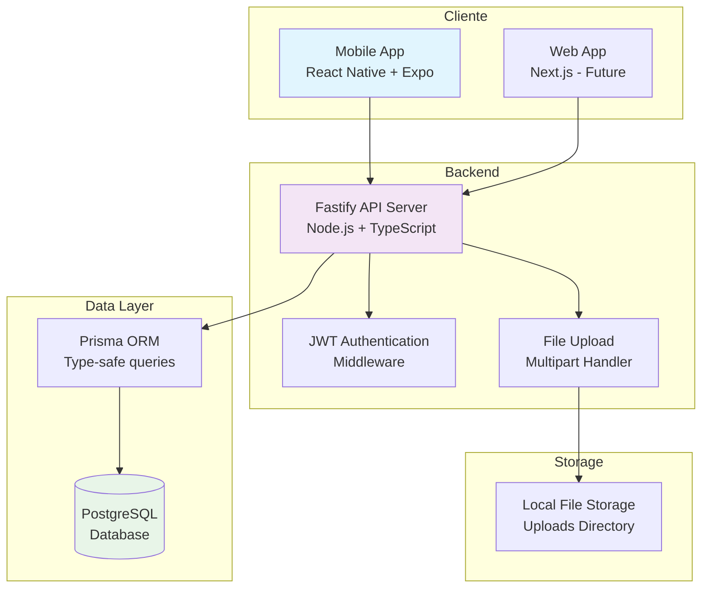

### 2.1 Estrutura do Monorepo

```
dizimos/
├── backend/           # API REST (Node.js + Fastify + Prisma)
│   ├── src/
│   │   ├── routes/    # Endpoints da API
│   │   ├── lib/       # Configurações e utilitários
│   │   ├── server.ts  # Servidor principal
│   │   └── seed.ts    # Dados iniciais
│   ├── prisma/        # Schema e migrações
│   └── uploads/       # Arquivos uploadados
├── mobile/            # App mobile (React Native + Expo)
│   ├── src/
│   │   ├── screens/   # Telas da aplicação
│   │   ├── components/# Componentes reutilizáveis
│   │   ├── navigation/# Navegação entre telas
│   │   └── services/  # Integração com API
│   └── assets/        # Recursos estáticos
├── web/              # App web (Next.js) - Futuro
└── package.json      # Configuração do monorepo
```

## 3. Backend Architecture

### 3.1 API Server (Fastify)

O backend utiliza Fastify como framework HTTP, oferecendo alta performance e um ecosistema de plugins robusto.

#### 3.1.1 Plugins Registrados

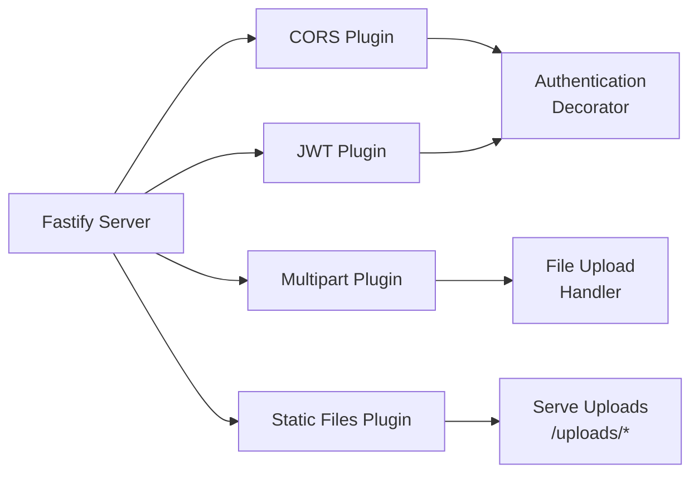

#### 3.1.2 Middleware Pipeline

| Middleware | Função | Aplicação |
|------------|---------|-----------|
| CORS | Habilita requisições cross-origin | Global |
| JWT | Validação de tokens | Rotas protegidas |
| Multipart | Upload de arquivos | Endpoints específicos |
| Static | Servir arquivos uploadados | /uploads/* |

### 3.2 API Endpoints

#### 3.2.1 Estrutura de Rotas

```mermaid
graph TD
    API["/api"] --> AUTH["/auth"]
    API --> MEMBERS["/members"]
    API --> CONTRIB["/contributions"]
    API --> CATEGORIES["/categories"]
    API --> REPORTS["/reports"]
    API --> DASHBOARD["/dashboard"]
    API --> UPLOAD["/upload"]
    
    AUTH --> LOGIN["/login<br/>POST"]
    AUTH --> LOGOUT["/logout<br/>POST"]
    AUTH --> ME["/me<br/>GET"]
    
    MEMBERS --> LIST_M["/\nGET - List"]
    MEMBERS --> CREATE_M["/\nPOST - Create"]
    MEMBERS --> UPDATE_M["/:id\nPUT - Update"]
    MEMBERS --> PHOTO_M["/:id/photo\nPOST - Upload"]
    
    CONTRIB --> LIST_C["/\nGET - List"]
    CONTRIB --> CREATE_C["/\nPOST - Create"]
    CONTRIB --> RECEIPT[/"/:id/receipt\nPOST - Upload"]
    
    DASHBOARD --> STATS["/stats\nGET - Statistics"]
```

#### 3.2.2 Endpoints Detalhados

| Endpoint | Método | Autenticação | Descrição |
|----------|--------|-------------|-----------|
| `/api/auth/login` | POST | ❌ | Login com email/senha |
| `/api/auth/logout` | POST | ✅ | Logout e invalidação de token |
| `/api/auth/me` | GET | ✅ | Perfil do usuário logado |
| `/api/members` | GET | ✅ | Listar membros com paginação |
| `/api/members` | POST | ✅ | Criar novo membro |
| `/api/members/:id` | PUT | ✅ | Atualizar dados do membro |
| `/api/members/:id/photo` | POST | ✅ | Upload foto do membro |
| `/api/contributions` | GET | ✅ | Listar contribuições |
| `/api/contributions` | POST | ✅ | Registrar nova contribuição |
| `/api/contributions/:id/receipt` | POST | ✅ | Upload comprovante |
| `/api/categories` | GET | ✅ | Listar categorias |
| `/api/categories` | POST | ✅ | Criar categoria |
| `/api/dashboard/stats` | GET | ✅ | Estatísticas do dashboard |

### 3.3 Data Models & ORM Mapping

#### 3.3.1 Prisma Schema Overview

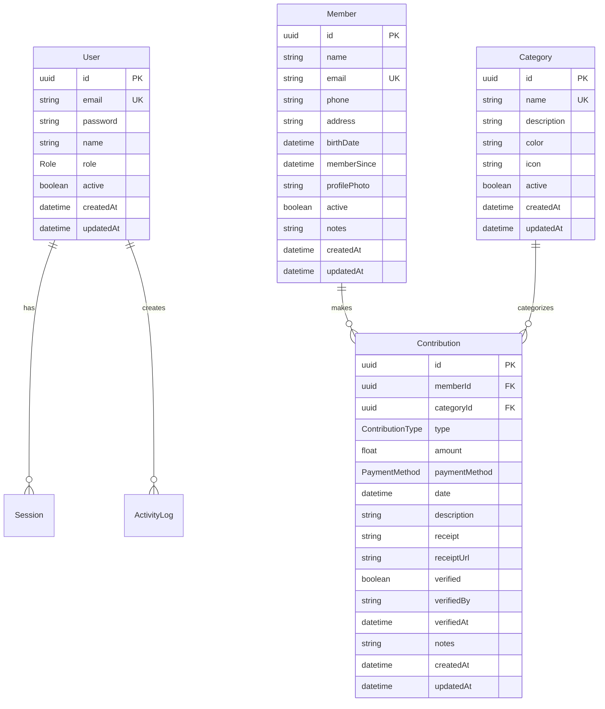

#### 3.3.2 Enums Definidos

```typescript
enum Role {
  ADMIN
  MODERATOR
  VIEWER
}

enum ContributionType {
  DIZIMO
  OFERTA
  OFERTA_MISSIONARIA
  EVENTO_ESPECIAL
  DOACAO_ESPECIAL
  OUTROS
}

enum PaymentMethod {
  DINHEIRO
  PIX
  CARTAO_CREDITO
  CARTAO_DEBITO
  TRANSFERENCIA
  CHEQUE
  BOLETO
}
```

#### 3.3.3 Índices de Performance

| Tabela | Índices | Otimização |
|--------|---------|------------|
| User | email (unique) | Login rápido |
| Session | userId, token | Validação de sessão |
| Member | email, phone | Busca de membros |
| Contribution | memberId, categoryId, date, type | Consultas e relatórios |
| ActivityLog | userId, entity, createdAt | Auditoria |

### 3.4 Business Logic Layer

#### 3.4.1 Gestão de Membros

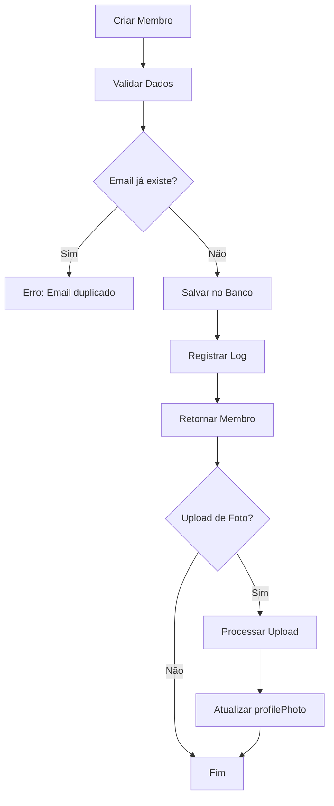

#### 3.4.2 Gestão de Contribuições

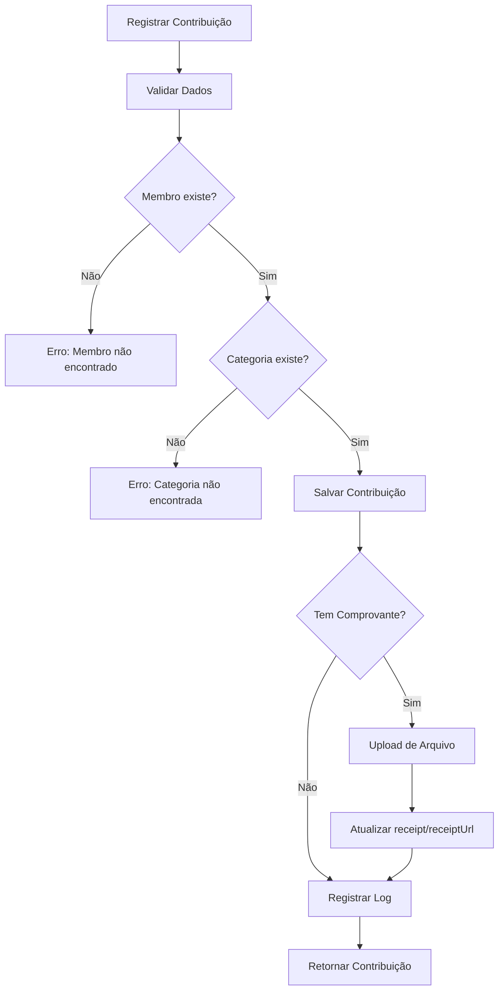

#### 3.4.3 Sistema de Autenticação

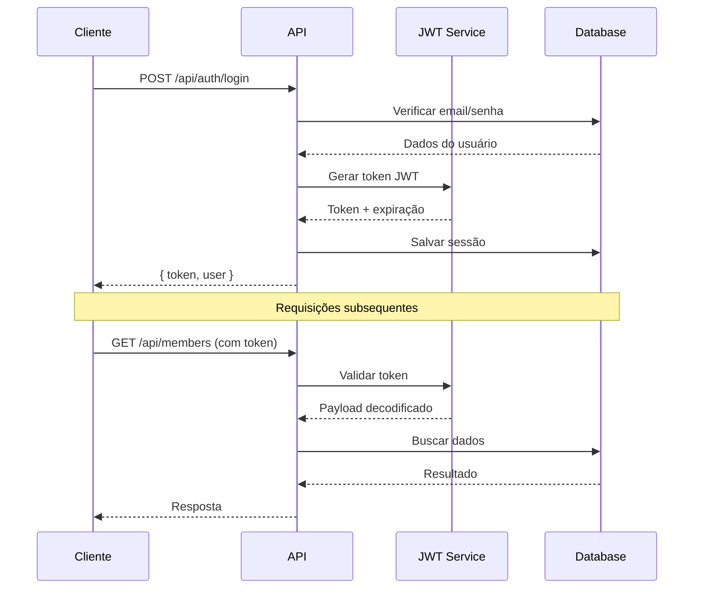

### 3.5 File Upload & Storage

#### 3.5.1 Estratégia de Upload

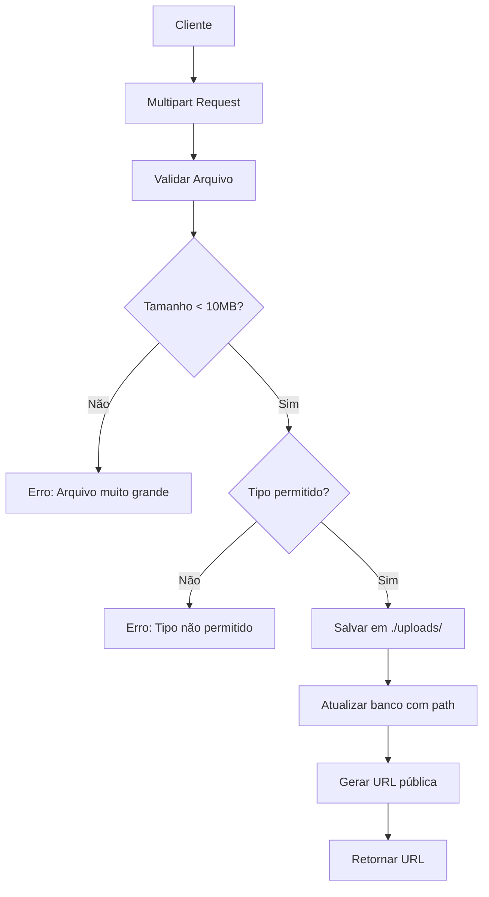

#### 3.5.2 Configuração de Storage

| Configuração | Valor | Descrição |
|-------------|--------|-----------|
| Diretório | `./uploads/` | Local de armazenamento |
| Tamanho máximo | 10MB | Limite por arquivo |
| Tipos permitidos | image/*, application/pdf | Comprovantes e fotos |
| URL pública | `/uploads/*` | Acesso via HTTP |

## 4. Mobile Architecture (React Native + Expo)

### 4.1 Estrutura de Navegação

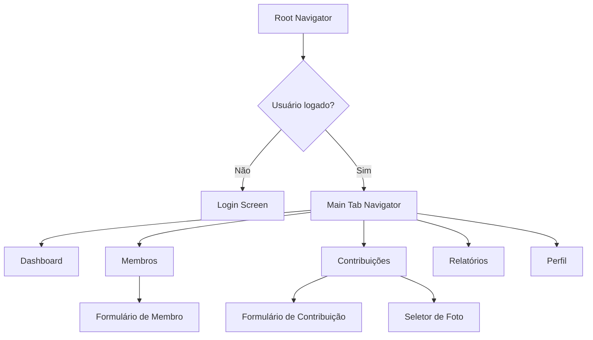

### 4.2 Screens Architecture

#### 4.2.1 Telas Principais

| Screen | Responsabilidade | Componentes Principais |
|--------|------------------|------------------------|
| `LoginScreen` | Autenticação de usuários | Form de login, validação |
| `DashboardScreen` | Visão geral e estatísticas | Cards, gráficos, pull-to-refresh |
| `MembersScreen` | Gestão de membros | Lista, busca, formulário modal |
| `ContributionsScreen` | Registro de contribuições | Lista, formulário, upload |
| `ReportsScreen` | Relatórios e exportações | Filtros, visualização |
| `ProfileScreen` | Perfil do usuário | Configurações, logout |

#### 4.2.2 Component Hierarchy

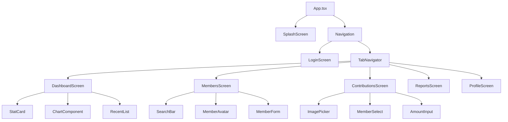

### 4.3 State Management

#### 4.3.1 Local State Pattern

```typescript
// Estado local por tela usando React hooks
const DashboardScreen = () => {
  const [stats, setStats] = useState(null);
  const [loading, setLoading] = useState(true);
  const [refreshing, setRefreshing] = useState(false);
  
  // Lógica de estado e efeitos
};
```

#### 4.3.2 Global State (AsyncStorage + SecureStore)

| Storage | Uso | Dados |
|---------|-----|-------|
| SecureStore | Dados sensíveis | JWT token, credenciais |
| AsyncStorage | Preferências | Configurações do app |
| Estado local | Dados temporários | Formulários, cache |

### 4.4 API Integration Layer

#### 4.4.1 HTTP Client Configuration

```typescript
// Configuração do Axios com interceptadores
const api = axios.create({
  baseURL: 'http://localhost:3333/api',
  timeout: 10000,
});

// Interceptador para adicionar token
api.interceptors.request.use((config) => {
  const token = SecureStore.getItemAsync('token');
  if (token) {
    config.headers.Authorization = `Bearer ${token}`;
  }
  return config;
});

// Interceptador para tratar erros de autenticação
api.interceptors.response.use(
  (response) => response,
  (error) => {
    if (error.response?.status === 401) {
      // Redirecionar para login
    }
    return Promise.reject(error);
  }
);
```

#### 4.4.2 Service Layer

```mermaid
graph LR
    SCREENS[Screens] --> SERVICES[Services Layer]
    SERVICES --> HTTP[HTTP Client]
    HTTP --> API[Backend API]
    
    SERVICES --> AUTH_SERVICE[AuthService]
    SERVICES --> MEMBER_SERVICE[MemberService]
    SERVICES --> CONTRIB_SERVICE[ContributionService]
    
    AUTH_SERVICE --> LOGIN[login()]
    AUTH_SERVICE --> LOGOUT[logout()]
    AUTH_SERVICE --> GET_PROFILE[getProfile()]
    
    MEMBER_SERVICE --> LIST[getMembers()]
    MEMBER_SERVICE --> CREATE[createMember()]
    MEMBER_SERVICE --> UPLOAD[uploadPhoto()]
```

### 4.5 UI/UX Design System

#### 4.5.1 Paleta de Cores

```typescript
const colors = {
  primary: '#1E3A8A',      // Azul da igreja
  secondary: '#3B82F6',    // Azul claro
  accent: '#FFD700',       // Dourado
  success: '#10B981',      // Verde
  warning: '#F59E0B',      // Laranja
  error: '#EF4444',        // Vermelho
  background: '#F8FAFC',   // Fundo claro
  surface: '#FFFFFF',      // Superfície
  text: '#1F2937',         // Texto principal
};
```

#### 4.5.2 Typography Scale

| Variante | Tamanho | Peso | Uso |
|----------|---------|------|-----|
| Heading 1 | 32px | Bold | Títulos principais |
| Heading 2 | 24px | SemiBold | Subtítulos |
| Body | 16px | Regular | Texto padrão |
| Caption | 14px | Regular | Legendas |
| Button | 16px | SemiBold | Botões |

#### 4.5.3 Componentes Base

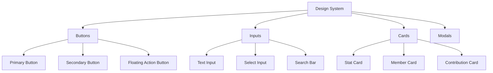

### 4.6 Permissions & Security

#### 4.6.1 Estratégia de Permissões

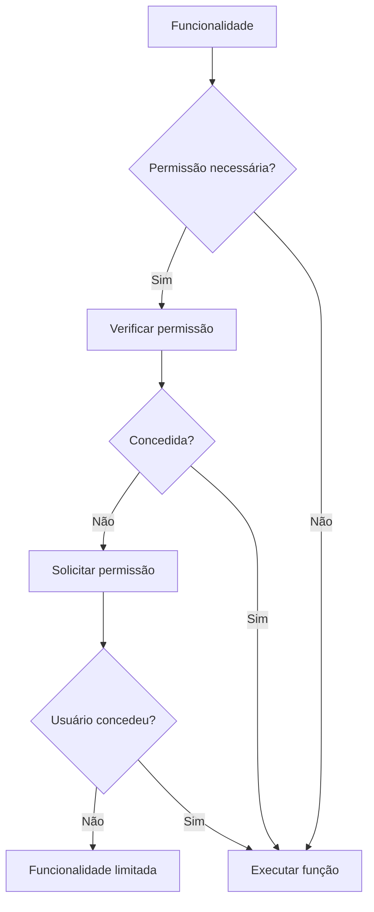

#### 4.6.2 Permissões Utilizadas

| Permissão | Uso | Quando Solicitar |
|-----------|-----|------------------|
| CAMERA | Fotografar comprovantes | No momento do upload |
| READ_EXTERNAL_STORAGE | Selecionar fotos da galeria | No momento da seleção |
| WRITE_EXTERNAL_STORAGE | Salvar fotos localmente | No momento do salvamento |

## 5. Testing Strategy

### 5.1 Backend Testing

#### 5.1.1 Estrutura de Testes

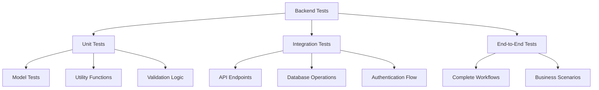

#### 5.1.2 Testes de API

| Endpoint | Cenários de Teste |
|----------|------------------|
| `/api/auth/login` | Credenciais válidas, inválidas, usuário inativo |
| `/api/members` | Criação, listagem, validação, duplicatas |
| `/api/contributions` | Registro, validação, upload de comprovantes |
| `/api/dashboard/stats` | Cálculos corretos, filtros por período |

### 5.2 Mobile Testing

#### 5.2.1 Estratégia de Testes

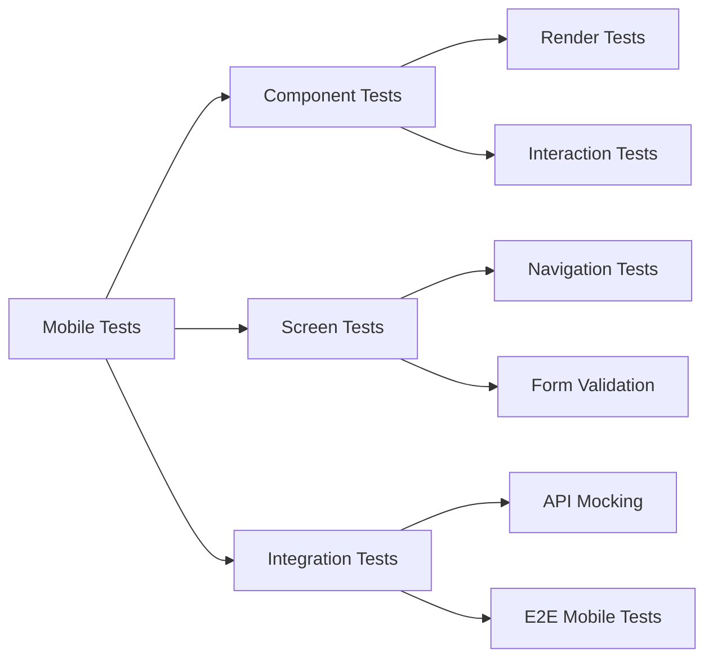

#### 5.2.2 Ferramentas de Teste

| Tipo | Ferramenta | Uso |
|------|-----------|-----|
| Unit | Jest + React Native Testing Library | Componentes e lógica |
| E2E | Detox | Fluxos completos no dispositivo |
| Visual | Storybook | Documentação de componentes |
| Performance | Flipper | Debug e profiling |

## 6. Segurança e Auditoria

### 6.1 Autenticação e Autorização

#### 6.1.1 Fluxo de Segurança

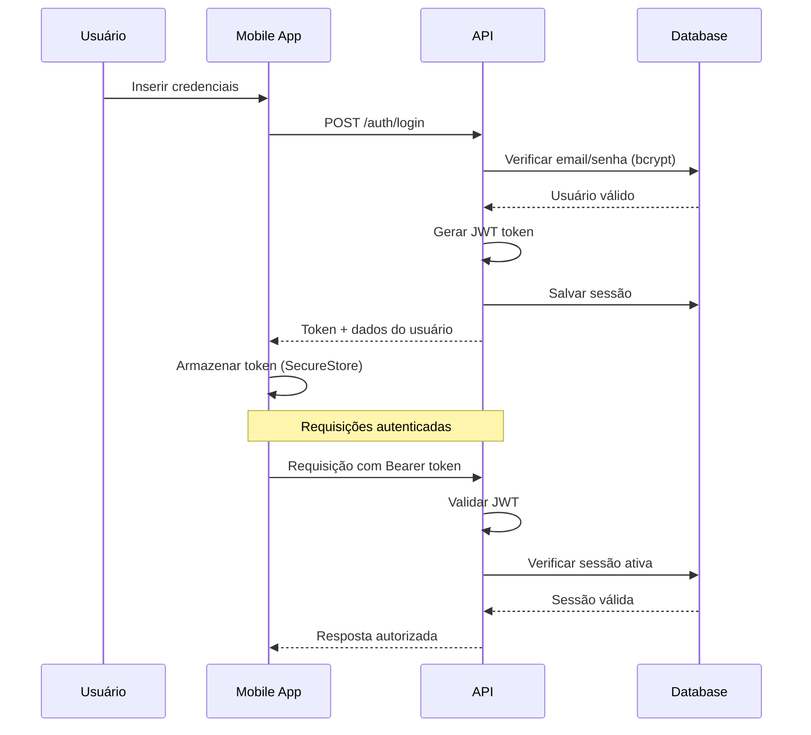

#### 6.1.2 Medidas de Segurança

| Camada | Medida | Implementação |
|--------|--------|---------------|
| Password | Hash bcrypt | Salt rounds: 12 |
| JWT | Secret forte | Variável de ambiente |
| Session | Controle de sessão | Tabela sessions |
| API | Rate limiting | Fastify rate limit |
| Upload | Validação de tipo | MIME type check |
| Storage | Dados sensíveis | Expo SecureStore |

### 6.2 Sistema de Auditoria

#### 6.2.1 Log de Atividades

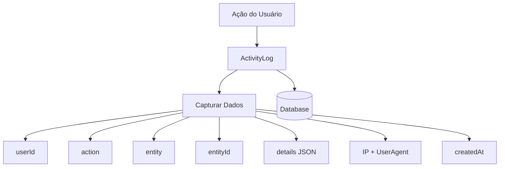

#### 6.2.2 Eventos Auditados

| Entidade | Ações Auditadas |
|----------|-----------------|
| Members | create, update, delete, photo_upload |
| Contributions | create, update, receipt_upload, verify |
| Categories | create, update, delete |
| Auth | login, logout, failed_login |
| Reports | generate, export |

## 7. Performance e Otimização

### 7.1 Database Performance

#### 7.1.1 Estratégias de Otimização

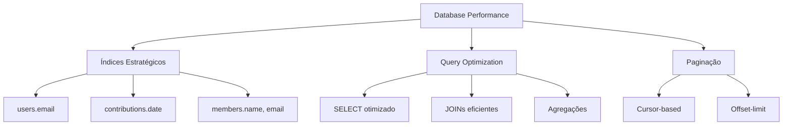

#### 7.1.2 Métricas de Performance

| Query | Tempo Esperado | Otimização |
|-------|----------------|------------|
| Dashboard stats | < 200ms | Índices em date, type |
| Member search | < 100ms | Full-text search index |
| Contribution list | < 150ms | Paginação + índices |
| Reports generation | < 2s | Background processing |

### 8.10 Estatísticas de Aniversários

#### 8.10.1 Métricas Disponíveis

| Métrica | Descrição | Visualização |
|---------|-----------|-------------|
| Distribuição por mês | Quantos aniversários por mês | Gráfico de barras |
| Distribuição por idade | Faixas etárias da igreja | Gráfico de pizza |
| Aniversários próximos | Lista dos próximos 30 dias | Lista cronológica |
| Taxa de parabenização | % de membros parabenizados | Indicador de progresso |

#### 8.10.2 Dashboard de Aniversários

```typescript
const BirthdayStatsSection = () => {
  return (
    <View>
      <StatsCard
        title="Este Mês"
        value={monthlyBirthdays.length}
        icon="calendar"
        color="#3B82F6"
      />
      
      <AgeDistributionChart data={ageGroups} />
      
      <MonthlyDistributionChart data={monthlyData} />
      
      <GreetingStats
        sent={greetingsSent}
        pending={greetingsPending}
      />
    </View>
  );
};
```

## 9. Sistema de Eventos da Igreja

### 9.1 Overview dos Eventos

O módulo de eventos permite gerenciar toda a agenda da igreja, desde cultos regulares até conferências especiais, com controle de presença e recursos.

### 9.2 Data Model - Eventos

```typescript
enum EventType {
  CULTO_DOMINICAL
  CULTO_QUARTA
  ESTUDO_BIBLICO
  CELULA
  CONFERENCIA
  SEMINARIO
  REUNIAO_LIDERANCA
  EVENTO_ESPECIAL
  CASAMENTO
  BATISMO
  SANTA_CEIA
  VIGILIA
}

enum EventStatus {
  AGENDADO
  EM_ANDAMENTO
  FINALIZADO
  CANCELADO
  ADIADO
}

model Event {
  id          String      @id @default(uuid())
  title       String
  description String?
  type        EventType
  status      EventStatus @default(AGENDADO)
  startDate   DateTime
  endDate     DateTime
  location    String?
  maxCapacity Int?
  isRecurring Boolean     @default(false)
  recurringPattern String? // JSON com padrão de recorrência
  preacher    String?     // Nome do pregador
  topic       String?     // Tema da mensagem
  notes       String?
  createdBy   String
  createdAt   DateTime    @default(now())
  updatedAt   DateTime    @updatedAt
  
  attendances EventAttendance[]
  resources   EventResource[]
  announcements EventAnnouncement[]
  
  @@index([startDate])
  @@index([type])
  @@index([status])
}

model EventAttendance {
  id       String   @id @default(uuid())
  eventId  String
  memberId String
  present  Boolean  @default(false)
  checkinTime DateTime?
  notes    String?
  
  event  Event  @relation(fields: [eventId], references: [id])
  member Member @relation(fields: [memberId], references: [id])
  
  @@unique([eventId, memberId])
}

model EventResource {
  id          String @id @default(uuid())
  eventId     String
  name        String
  type        String // EQUIPAMENTO, MATERIAL, PESSOA
  quantity    Int    @default(1)
  responsible String?
  notes       String?
  
  event Event @relation(fields: [eventId], references: [id])
}
```

### 9.3 API Endpoints - Eventos

| Endpoint | Método | Descrição |
|----------|--------|----------|
| `/api/events` | GET | Listar eventos |
| `/api/events` | POST | Criar evento |
| `/api/events/:id` | PUT | Atualizar evento |
| `/api/events/:id/attendance` | GET | Lista de presença |
| `/api/events/:id/checkin` | POST | Fazer check-in |
| `/api/events/calendar/:month` | GET | Calendário mensal |

## 10. Sistema de Grupos e Ministérios

### 10.1 Estrutura de Grupos

```typescript
enum GroupType {
  CELULA
  JOVENS
  ADOLESCENTES
  CRIANCAS
  TERCEIRA_IDADE
  CASAIS
  MINISTERIO_LOUVOR
  MINISTERIO_DIACONIA
  ESCOLA_DOMINICAL
  INTERCESSAO
  EVANGELISMO
}

enum MemberRole {
  LIDER
  VICE_LIDER
  SECRETARIO
  TESOUREIRO
  MEMBRO
}

model Group {
  id          String    @id @default(uuid())
  name        String
  description String?
  type        GroupType
  leaderId    String?
  meetingDay  String?   // DIA DA SEMANA
  meetingTime String?   // HORÁRIO
  location    String?
  active      Boolean   @default(true)
  maxMembers  Int?
  createdAt   DateTime  @default(now())
  updatedAt   DateTime  @updatedAt
  
  members     GroupMember[]
  meetings    GroupMeeting[]
  
  leader Member? @relation(fields: [leaderId], references: [id])
}

model GroupMember {
  id       String     @id @default(uuid())
  groupId  String
  memberId String
  role     MemberRole @default(MEMBRO)
  joinDate DateTime   @default(now())
  active   Boolean    @default(true)
  
  group  Group  @relation(fields: [groupId], references: [id])
  member Member @relation(fields: [memberId], references: [id])
  
  @@unique([groupId, memberId])
}

model GroupMeeting {
  id          String   @id @default(uuid())
  groupId     String
  date        DateTime
  topic       String?
  summary     String?
  attendance  Int?
  notes       String?
  
  group Group @relation(fields: [groupId], references: [id])
}
```

## 11. Sistema de Visitantes

### 11.1 Gestão de Visitantes

```typescript
enum VisitorStatus {
  PRIMEIRA_VISITA
  VISITANTE_ASSIDUO
  EM_DISCIPULADO
  CONVERTIDO
  MEMBRO
  INATIVO
}

model Visitor {
  id          String        @id @default(uuid())
  name        String
  email       String?
  phone       String?
  address     String?
  birthDate   DateTime?
  profession  String?
  status      VisitorStatus @default(PRIMEIRA_VISITA)
  invitedBy   String?       // Quem convidou
  notes       String?
  createdAt   DateTime      @default(now())
  updatedAt   DateTime      @updatedAt
  
  visits         VisitorVisit[]
  followUps      VisitorFollowUp[]
  inviter        Member? @relation(fields: [invitedBy], references: [id])
}

model VisitorVisit {
  id        String   @id @default(uuid())
  visitorId String
  date      DateTime @default(now())
  eventType String   // CULTO, CÉLULA, etc
  notes     String?
  
  visitor Visitor @relation(fields: [visitorId], references: [id])
}

model VisitorFollowUp {
  id         String   @id @default(uuid())
  visitorId  String
  date       DateTime @default(now())
  type       String   // LIGACAO, VISITA, WHATSAPP
  responsibleId String
  summary    String
  nextAction String?
  completed  Boolean  @default(true)
  
  visitor     Visitor @relation(fields: [visitorId], references: [id])
  responsible Member  @relation(fields: [responsibleId], references: [id])
}
```

## 12. Sistema de Oração

### 12.1 Pedidos de Oração

```typescript
enum PrayerRequestType {
  SAUDE
  FAMILIA
  FINANCEIRO
  TRABALHO
  ESPIRITUAL
  MINISTERIAL
  URGENTE
  AGRADECIMENTO
}

enum PrayerStatus {
  ATIVO
  RESPONDIDO
  CANCELADO
}

model PrayerRequest {
  id          String            @id @default(uuid())
  title       String
  description String
  type        PrayerRequestType
  status      PrayerStatus      @default(ATIVO)
  isPublic    Boolean           @default(false)
  isUrgent    Boolean           @default(false)
  requesterId String?
  createdAt   DateTime          @default(now())
  updatedAt   DateTime          @updatedAt
  
  requester Member? @relation(fields: [requesterId], references: [id])
  prayers   Prayer[]
}

model Prayer {
  id              String  @id @default(uuid())
  prayerRequestId String
  memberId        String
  message         String?
  prayedAt        DateTime @default(now())
  
  prayerRequest PrayerRequest @relation(fields: [prayerRequestId], references: [id])
  member        Member        @relation(fields: [memberId], references: [id])
}

model PrayerCampaign {
  id          String   @id @default(uuid())
  title       String
  description String
  startDate   DateTime
  endDate     DateTime
  goal        String?
  active      Boolean  @default(true)
  createdAt   DateTime @default(now())
}
```

## 13. Sistema de Comunicação

### 13.1 Avisos e Boletins

```typescript
enum AnnouncementType {
  AVISO_GERAL
  EVENTO
  URGENTE
  BOLETIM
  DEVOCIONAL
  INFORMATIVO
}

enum AnnouncementTarget {
  TODOS
  MEMBROS
  LIDERANCA
  GRUPO_ESPECIFICO
  VISITANTES
}

model Announcement {
  id          String             @id @default(uuid())
  title       String
  content     String
  type        AnnouncementType
  target      AnnouncementTarget
  priority    Int                @default(1) // 1-5
  publishDate DateTime           @default(now())
  expiryDate  DateTime?
  authorId    String
  active      Boolean            @default(true)
  imageUrl    String?
  
  author User @relation(fields: [authorId], references: [id])
  views  AnnouncementView[]
}

model AnnouncementView {
  id             String @id @default(uuid())
  announcementId String
  memberId       String
  viewedAt       DateTime @default(now())
  
  announcement Announcement @relation(fields: [announcementId], references: [id])
  member       Member       @relation(fields: [memberId], references: [id])
  
  @@unique([announcementId, memberId])
}

model Bulletin {
  id          String   @id @default(uuid())
  title       String
  content     String   // HTML ou Markdown
  publishDate DateTime @default(now())
  authorId    String
  pdfUrl      String?
  active      Boolean  @default(true)
  
  author User @relation(fields: [authorId], references: [id])
}
```

## 14. Sistema de Presença

### 14.1 Controle de Frequência

```typescript
model AttendanceRecord {
  id        String   @id @default(uuid())
  memberId  String
  eventId   String?
  date      DateTime @default(now())
  eventType String   // CULTO_DOMINGO, CULTO_QUARTA, CELULA
  present   Boolean  @default(true)
  late      Boolean  @default(false)
  checkinTime DateTime?
  notes     String?
  
  member Member @relation(fields: [memberId], references: [id])
  event  Event? @relation(fields: [eventId], references: [id])
  
  @@index([memberId, date])
  @@index([eventType, date])
}

model AttendanceGoal {
  id       String @id @default(uuid())
  memberId String
  year     Int
  month    Int?
  goal     Int    // Meta de presenças no período
  achieved Int    @default(0)
  
  member Member @relation(fields: [memberId], references: [id])
  
  @@unique([memberId, year, month])
}
```

### 14.2 Relatórios de Presença

| Relatório | Descrição | Período |
|------------|-----------|----------|
| Frequência Individual | % de presença por membro | Mensal/Anual |
| Ranking de Presença | Membros mais assíduos | Mensal |
| Média de Cultos | Média de pessoas por culto | Semanal/Mensal |
| Crescimento | Comparação de períodos | Trimestral |

## 15. Sistema de Patrimônio

### 15.1 Controle de Bens

```typescript
enum AssetCategory {
  EQUIPAMENTO_SOM
  INSTRUMENTOS
  MOVEIS
  ELETRONICOS
  VEICULOS
  IMOVEIS
  LIVROS
  DECORACAO
  OUTROS
}

enum AssetStatus {
  ATIVO
  MANUTENCAO
  INATIVO
  VENDIDO
  DOADO
  PERDIDO
}

model Asset {
  id           String        @id @default(uuid())
  name         String
  description  String?
  category     AssetCategory
  status       AssetStatus   @default(ATIVO)
  purchaseDate DateTime?
  purchaseValue Float?
  currentValue Float?
  location     String?
  responsible  String?       // Quem é responsável
  serialNumber String?
  brand        String?
  model        String?
  warrantyDate DateTime?
  notes        String?
  imageUrl     String?
  createdAt    DateTime      @default(now())
  updatedAt    DateTime      @updatedAt
  
  maintenances AssetMaintenance[]
  loans        AssetLoan[]
}

model AssetMaintenance {
  id          String   @id @default(uuid())
  assetId     String
  date        DateTime @default(now())
  type        String   // PREVENTIVA, CORRETIVA, LIMPEZA
  description String
  cost        Float?
  technician  String?
  nextDate    DateTime?
  
  asset Asset @relation(fields: [assetId], references: [id])
}

model AssetLoan {
  id         String    @id @default(uuid())
  assetId    String
  borrowerId String
  loanDate   DateTime  @default(now())
  returnDate DateTime?
  purpose    String?
  returned   Boolean   @default(false)
  condition  String?   // Estado do item na devolução
  
  asset    Asset  @relation(fields: [assetId], references: [id])
  borrower Member @relation(fields: [borrowerId], references: [id])
}
```

## 16. Agenda Pastoral

### 16.1 Compromissos Pastorais

```typescript
enum AppointmentType {
  ACONSELHAMENTO
  VISITA_HOSPITALAR
  VISITA_DOMICILIAR
  CASAMENTO
  FUNERAL
  BATISMO
  REUNIAO
  ESTUDO
  PREGACAO
  VIAGEM
  FERIAS
}

enum AppointmentStatus {
  AGENDADO
  CONFIRMADO
  REALIZADO
  CANCELADO
  REAGENDADO
}

model PastoralAppointment {
  id          String            @id @default(uuid())
  title       String
  description String?
  type        AppointmentType
  status      AppointmentStatus @default(AGENDADO)
  startTime   DateTime
  endTime     DateTime
  location    String?
  attendees   String?           // Lista de participantes
  memberId    String?           // Membro relacionado
  notes       String?
  remindAt    DateTime?         // Quando lembrar
  createdAt   DateTime          @default(now())
  updatedAt   DateTime          @updatedAt
  
  member Member? @relation(fields: [memberId], references: [id])
}

model PastoralVisit {
  id        String   @id @default(uuid())
  memberId  String
  date      DateTime @default(now())
  type      String   // HOSPITAL, CASA, TRABALHO
  purpose   String   // ORAO, ACONSELHAMENTO, COMUNHAO
  summary   String
  prayer    String?
  followUp  String?  // Próximas ações
  visitedBy String   // Pastor/Líder
  
  member Member @relation(fields: [memberId], references: [id])
}
```

## 17. Sistema de Biblioteca

### 17.1 Controle de Livros

```typescript
enum BookCategory {
  TEOLOGIA
  DEVOCIONAL
  BIOGRAFIA
  HISTORIA
  APOLOGETICA
  FAMILIA
  JUVENTUDE
  CRIANCAS
  MINISTERIAL
  OUTROS
}

enum BookStatus {
  DISPONIVEL
  EMPRESTADO
  RESERVADO
  MANUTENCAO
  PERDIDO
}

model Book {
  id          String       @id @default(uuid())
  title       String
  author      String
  isbn        String?
  category    BookCategory
  status      BookStatus   @default(DISPONIVEL)
  publisher   String?
  publishYear Int?
  pages       Int?
  language    String       @default('PT')
  location    String?      // Localização na biblioteca
  condition   String?      // Estado de conservação
  summary     String?
  imageUrl    String?
  createdAt   DateTime     @default(now())
  updatedAt   DateTime     @updatedAt
  
  loans       BookLoan[]
  reserves    BookReservation[]
}

model BookLoan {
  id         String    @id @default(uuid())
  bookId     String
  memberId   String
  loanDate   DateTime  @default(now())
  dueDate    DateTime
  returnDate DateTime?
  returned   Boolean   @default(false)
  renewals   Int       @default(0)
  fine       Float?    // Multa por atraso
  notes      String?
  
  book   Book   @relation(fields: [bookId], references: [id])
  member Member @relation(fields: [memberId], references: [id])
}

model BookReservation {
  id        String   @id @default(uuid())
  bookId    String
  memberId  String
  date      DateTime @default(now())
  expiresAt DateTime
  active    Boolean  @default(true)
  
  book   Book   @relation(fields: [bookId], references: [id])
  member Member @relation(fields: [memberId], references: [id])
}
```

## 18. Sistema de Cerimônias

### 18.1 Casamentos e Batismos

```typescript
enum CeremonyType {
  CASAMENTO
  BATISMO
  APRESENTACAO_CRIANCA
  SANTA_CEIA
  CONSAGRACAO
  ORDENACAO
}

enum CeremonyStatus {
  AGENDADO
  CONFIRMADO
  REALIZADO
  CANCELADO
}

model Ceremony {
  id          String          @id @default(uuid())
  type        CeremonyType
  status      CeremonyStatus  @default(AGENDADO)
  date        DateTime
  location    String?
  officiant   String          // Pastor/Líder
  notes       String?
  photos      String?         // URLs das fotos
  certificate String?         // URL do certificado
  createdAt   DateTime        @default(now())
  updatedAt   DateTime        @updatedAt
  
  participants CeremonyParticipant[]
}

model CeremonyParticipant {
  id         String @id @default(uuid())
  ceremonyId String
  memberId   String?
  name       String // Para não-membros
  role       String // NOIVO, NOIVA, BATIZANDO, PADRINHO
  
  ceremony Ceremony @relation(fields: [ceremonyId], references: [id])
  member   Member?  @relation(fields: [memberId], references: [id])
}

model Wedding {
  id          String   @id @default(uuid())
  ceremonyId  String   @unique
  groomId     String?
  brideId     String?
  groomName   String
  brideName   String
  venue       String
  reception   String?
  witnesses   String   // JSON com testemunhas
  
  ceremony Ceremony @relation(fields: [ceremonyId], references: [id])
  groom    Member?  @relation("GroomWeddings", fields: [groomId], references: [id])
  bride    Member?  @relation("BrideWeddings", fields: [brideId], references: [id])
}

model Baptism {
  id         String   @id @default(uuid())
  ceremonyId String   @unique
  memberId   String?
  name       String
  age        Int?
  parents    String?  // Para menores
  testimony  String?
  
  ceremony Ceremony @relation(fields: [ceremonyId], references: [id])
  member   Member?  @relation(fields: [memberId], references: [id])
}
```

## 19. Mobile App Extensions - Novas Telas

### 19.1 Nova Estrutura de Navegação

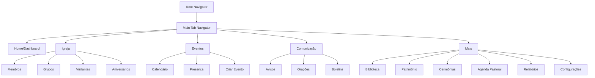

### 19.2 Principais Screens Adicionais

| Screen | Funcionalidade Principal |
|--------|-------------------------|
| `ChurchCalendarScreen` | Calendário de eventos com filtros |
| `GroupsScreen` | Lista de grupos/ministérios |
| `VisitorsScreen` | Cadastro e acompanhamento de visitantes |
| `PrayerScreen` | Pedidos de oração e campanhas |
| `AnnouncementsScreen` | Avisos e comunicações |
| `LibraryScreen` | Catálogo e empréstimos |
| `AssetsScreen` | Controle de patrimônio |
| `CeremoniesScreen` | Agendamento de cerimônias |
| `AttendanceScreen` | Check-in e frequência |
| `PastoralAgendaScreen` | Agenda dos pastores |

### 19.3 Dashboard Expandido

```typescript
const ExpandedDashboard = () => {
  return (
    <ScrollView>
      {/* Widgets Existentes */}
      <StatsSection />
      <BirthdayWidget />
      
      {/* Novos Widgets */}
      <TodayEventsWidget />
      <RecentAnnouncementsWidget />
      <PrayerRequestsWidget />
      <AttendanceStatsWidget />
      <UpcomingCeremoniesWidget />
      <LibraryDueBooksWidget />
      
      {/* Ações Rápidas */}
      <QuickActionsGrid>
        <QuickAction icon="person-add" title="Novo Visitante" />
        <QuickAction icon="calendar" title="Criar Evento" />
        <QuickAction icon="megaphone" title="Novo Aviso" />
        <QuickAction icon="hands-pray" title="Pedido Oração" />
      </QuickActionsGrid>
    </ScrollView>
  );
};
```

## 20. Sistema Financeiro Avançado

### 20.1 Gestão Orçamentária

```typescript
enum TransactionType {
  RECEITA
  DESPESA
  TRANSFERENCIA
  INVESTIMENTO
}

enum ExpenseCategory {
  SALARIOS
  MANUTENCAO
  UTILIDADES // Luz, água, telefone
  MATERIAIS
  COMBUSTIVEL
  ALIMENTACAO
  EVENTOS
  MISSOES
  OBRAS
  EQUIPAMENTOS
  IMPOSTOS
  OUTROS
}

model Budget {
  id          String   @id @default(uuid())
  year        Int
  month       Int?
  category    String
  planned     Float    // Valor planejado
  actual      Float    @default(0) // Valor real gasto
  variance    Float?   // Diferença entre planejado e real
  notes       String?
  createdAt   DateTime @default(now())
  updatedAt   DateTime @updatedAt
  
  @@unique([year, month, category])
}

model Transaction {
  id            String          @id @default(uuid())
  type          TransactionType
  category      ExpenseCategory?
  amount        Float
  description   String
  date          DateTime        @default(now())
  paymentMethod String?
  supplier      String?         // Fornecedor
  invoice       String?         // Número da nota fiscal
  receipt       String?         // Comprovante
  budgetId      String?
  authorizedBy  String          // Quem autorizou
  paidBy        String?         // Quem pagou
  createdAt     DateTime        @default(now())
  
  budget Budget? @relation(fields: [budgetId], references: [id])
}

model Supplier {
  id       String @id @default(uuid())
  name     String
  cnpj     String?
  contact  String?
  email    String?
  phone    String?
  address  String?
  category String? // Tipo de fornecedor
  active   Boolean @default(true)
  
  transactions Transaction[]
}

model CashFlow {
  id          String   @id @default(uuid())
  date        DateTime
  opening     Float    // Saldo inicial
  income      Float    // Entradas do dia
  expenses    Float    // Saídas do dia
  closing     Float    // Saldo final
  notes       String?
  reconciled  Boolean  @default(false)
}
```

### 20.2 Integração PIX

```typescript
model PixTransaction {
  id            String   @id @default(uuid())
  pixKey        String   // Chave PIX da igreja
  amount        Float
  description   String?
  memberId      String?  // Se identificado
  payerName     String?
  payerDocument String?
  txId          String   @unique // ID da transação PIX
  endToEndId    String   @unique // E2E ID
  status        String   // PENDING, COMPLETED, FAILED
  processedAt   DateTime?
  createdAt     DateTime @default(now())
  
  member Member? @relation(fields: [memberId], references: [id])
}
```

## 21. Portal do Membro (Web)

### 21.1 Arquitetura do Portal

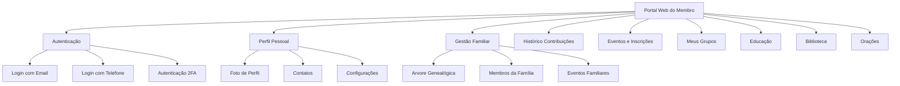

### 21.2 Data Models - Portal

```typescript
model MemberPortalAccess {
  id        String   @id @default(uuid())
  memberId  String   @unique
  email     String   @unique
  password  String
  active    Boolean  @default(true)
  lastLogin DateTime?
  loginCount Int     @default(0)
  createdAt DateTime @default(now())
  
  member Member @relation(fields: [memberId], references: [id])
}

model Family {
  id          String   @id @default(uuid())
  name        String   // Sobrenome da família
  headId      String?  // Cabeça da família
  address     String?
  phone       String?
  notes       String?
  createdAt   DateTime @default(now())
  
  members     FamilyMember[]
  head        Member? @relation(fields: [headId], references: [id])
}

model FamilyMember {
  id         String @id @default(uuid())
  familyId   String
  memberId   String
  relationship String // PAI, MAE, FILHO, CONJUGE, etc
  
  family Family @relation(fields: [familyId], references: [id])
  member Member @relation(fields: [memberId], references: [id])
  
  @@unique([familyId, memberId])
}

model DigitalCard {
  id        String   @id @default(uuid())
  memberId  String   @unique
  cardNumber String  @unique
  qrCode    String   // QR Code para identificação
  issuedAt  DateTime @default(now())
  expiresAt DateTime?
  active    Boolean  @default(true)
  
  member Member @relation(fields: [memberId], references: [id])
}
```

## 22. Ministério de Música

### 22.1 Gestão Musical

```typescript
enum InstrumentType {
  VOCAL
  PIANO
  GUITARRA
  BAIXO
  BATERIA
  VIOLAO
  TECLADO
  SAX
  TROMPETE
  VIOLINO
  OUTROS
}

enum SkillLevel {
  INICIANTE
  INTERMEDIARIO
  AVANCADO
  PROFISSIONAL
}

model Musician {
  id        String   @id @default(uuid())
  memberId  String
  active    Boolean  @default(true)
  leader    Boolean  @default(false)
  joinDate  DateTime @default(now())
  notes     String?
  
  member      Member           @relation(fields: [memberId], references: [id])
  instruments MusicianInstrument[]
  schedules   MusicSchedule[]
}

model MusicianInstrument {
  id           String       @id @default(uuid())
  musicianId   String
  instrument   InstrumentType
  skillLevel   SkillLevel
  primary      Boolean      @default(false)
  yearsPlaying Int?
  
  musician Musician @relation(fields: [musicianId], references: [id])
}

model Song {
  id         String   @id @default(uuid())
  title      String
  artist     String?
  genre      String?
  key        String?  // Tom da música
  bpm        Int?     // Batidas por minuto
  duration   Int?     // Duração em segundos
  lyrics     String?  // Letra da música
  chords     String?  // Cifras
  sheetMusic String?  // URL da partitura
  audioUrl   String?  // URL do áudio
  videoUrl   String?  // URL do vídeo
  category   String?  // LOUVOR, ADORACAO, CONGREGACIONAL
  active     Boolean  @default(true)
  createdAt  DateTime @default(now())
  
  setlists   SetlistSong[]
  rehearsals RehearsalSong[]
}

model Setlist {
  id        String   @id @default(uuid())
  name      String
  eventId   String?  // Evento relacionado
  date      DateTime
  notes     String?
  createdBy String
  
  songs SetlistSong[]
  event Event? @relation(fields: [eventId], references: [id])
}

model SetlistSong {
  id        String @id @default(uuid())
  setlistId String
  songId    String
  order     Int
  key       String? // Tom específico para esta apresentação
  notes     String?
  
  setlist Setlist @relation(fields: [setlistId], references: [id])
  song    Song    @relation(fields: [songId], references: [id])
}

model MusicSchedule {
  id         String   @id @default(uuid())
  eventId    String
  musicianId String
  role       String   // VOCAL, GUITARRA, etc
  confirmed  Boolean  @default(false)
  substitute Boolean  @default(false)
  notes      String?
  
  event    Event    @relation(fields: [eventId], references: [id])
  musician Musician @relation(fields: [musicianId], references: [id])
}

model Rehearsal {
  id        String   @id @default(uuid())
  date      DateTime
  duration  Int?     // Duração em minutos
  location  String?
  notes     String?
  recording String?  // URL da gravação
  
  songs       RehearsalSong[]
  attendances RehearsalAttendance[]
}

model RehearsalSong {
  id         String @id @default(uuid())
  rehearsalId String
  songId     String
  practiced  Boolean @default(false)
  notes      String?
  
  rehearsal Rehearsal @relation(fields: [rehearsalId], references: [id])
  song      Song      @relation(fields: [songId], references: [id])
}

model RehearsalAttendance {
  id         String  @id @default(uuid())
  rehearsalId String
  musicianId String
  present    Boolean @default(false)
  late       Boolean @default(false)
  excused    Boolean @default(false)
  
  rehearsal Rehearsal @relation(fields: [rehearsalId], references: [id])
  musician  Musician  @relation(fields: [musicianId], references: [id])
}
```

## 23. Funcionalidades Mobile Avançadas

### 23.1 Chat Interno

```typescript
model ChatChannel {
  id          String   @id @default(uuid())
  name        String
  description String?
  type        String   // GERAL, LIDERANCA, GRUPO, DIRETO
  private     Boolean  @default(false)
  createdBy   String
  createdAt   DateTime @default(now())
  
  members  ChatMember[]
  messages ChatMessage[]
}

model ChatMember {
  id        String   @id @default(uuid())
  channelId String
  memberId  String
  role      String   @default('MEMBER') // ADMIN, MODERATOR, MEMBER
  joinedAt  DateTime @default(now())
  lastRead  DateTime?
  
  channel ChatChannel @relation(fields: [channelId], references: [id])
  member  Member      @relation(fields: [memberId], references: [id])
}

model ChatMessage {
  id        String   @id @default(uuid())
  channelId String
  senderId  String
  content   String
  type      String   @default('TEXT') // TEXT, IMAGE, FILE, LOCATION
  fileUrl   String?
  replyTo   String?  // ID da mensagem que está respondendo
  edited    Boolean  @default(false)
  sentAt    DateTime @default(now())
  
  channel ChatChannel @relation(fields: [channelId], references: [id])
  sender  Member      @relation(fields: [senderId], references: [id])
}
```

### 23.2 Localização GPS

```typescript
model VisitLocation {
  id         String   @id @default(uuid())
  memberId   String
  latitude   Float
  longitude  Float
  address    String?
  type       String   // CASA, TRABALHO, HOSPITAL
  verified   Boolean  @default(false)
  createdAt  DateTime @default(now())
  
  member Member @relation(fields: [memberId], references: [id])
}

model GPSTrack {
  id        String   @id @default(uuid())
  userId    String
  latitude  Float
  longitude Float
  accuracy  Float?
  timestamp DateTime @default(now())
  purpose   String   // VISITA, EVENTO, EMERGENCIA
  
  user User @relation(fields: [userId], references: [id])
}
```

### 23.3 Sincronização Offline

```typescript
model SyncQueue {
  id        String   @id @default(uuid())
  action    String   // CREATE, UPDATE, DELETE
  table     String   // Nome da tabela
  recordId  String   // ID do registro
  data      Json     // Dados para sincronizar
  synced    Boolean  @default(false)
  attempts  Int      @default(0)
  error     String?
  createdAt DateTime @default(now())
  syncedAt  DateTime?
}

model OfflineData {
  id        String   @id @default(uuid())
  userId    String
  table     String
  data      Json
  lastSync  DateTime @default(now())
  
  user User @relation(fields: [userId], references: [id])
}
```

## 24. Integração Digital

### 24.1 QR Codes

```typescript
model QRCode {
  id        String   @id @default(uuid())
  code      String   @unique
  type      String   // CHECKIN, MEMBER, EVENT, DONATION
  targetId  String?  // ID do alvo (evento, membro, etc)
  data      Json?    // Dados adicionais
  active    Boolean  @default(true)
  usageCount Int     @default(0)
  maxUsage  Int?
  expiresAt DateTime?
  createdAt DateTime @default(now())
}

model QRCodeScan {
  id        String   @id @default(uuid())
  qrCodeId  String
  scannedBy String
  scannedAt DateTime @default(now())
  location  String?
  success   Boolean  @default(true)
  
  qrCode QRCode @relation(fields: [qrCodeId], references: [id])
  member Member @relation(fields: [scannedBy], references: [id])
}
```

### 24.2 Transmissão ao Vivo

```typescript
model LiveStream {
  id          String   @id @default(uuid())
  title       String
  description String?
  eventId     String?
  platform    String   // YOUTUBE, FACEBOOK, INSTAGRAM
  streamKey   String?
  streamUrl   String?
  status      String   @default('SCHEDULED') // SCHEDULED, LIVE, ENDED
  startTime   DateTime
  endTime     DateTime?
  viewers     Int      @default(0)
  
  event Event? @relation(fields: [eventId], references: [id])
}

model SocialPost {
  id        String   @id @default(uuid())
  platform  String   // FACEBOOK, INSTAGRAM, TWITTER
  content   String
  imageUrl  String?
  eventId   String?
  scheduled Boolean  @default(false)
  publishAt DateTime?
  published Boolean  @default(false)
  postId    String?  // ID do post na plataforma
  createdAt DateTime @default(now())
  
  event Event? @relation(fields: [eventId], references: [id])
}
```

#### 7.2.1 Otimizações Implementadas

```mermaid
graph LR
    MOBILE_PERF[Mobile Performance] --> IMAGES[Image Optimization]
    MOBILE_PERF --> LISTS[List Virtualization]
    MOBILE_PERF --> CACHE[Caching Strategy]
    MOBILE_PERF --> LAZY[Lazy Loading]
    
    IMAGES --> COMPRESS[Image Compression]
    IMAGES --> RESIZE[Auto Resize]
    
    LISTS --> FLAT_LIST[FlatList]
    LISTS --> PAGINATION[Pull-to-refresh]
    
    CACHE --> API_CACHE[API Response Cache]
    CACHE --> IMAGE_CACHE[Image Cache]
    
    LAZY --> SCREENS[Screen-based loading]
    LAZY --> COMPONENTS[Component lazy loading]
```

#### 7.2.2 Bundle Size Optimization

| Estratégia | Implementação | Benefício |
|------------|---------------|-----------|
| Tree shaking | Import específicos | -20% bundle size |
| Image optimization | WebP/optimized formats | -40% asset size |
| Code splitting | Route-based splitting | Carregamento incremental |
| Dependency audit | Remove unused packages | Bundle mais limpo |

## 8. Gestão de Aniversários dos Irmãos

### 8.1 Overview da Funcionalidade

O sistema de aniversários permite que a igreja mantenha controle das datas de nascimento dos membros, enviando notificações e mantendo a comunidade engajada através de parabenizações organizadas.

### 8.2 Arquitetura do Sistema de Aniversários

```mermaid
graph TD
    MEMBER[Member Data] --> BIRTH[birthDate field]
    BIRTH --> CALC[Birthday Calculator]
    CALC --> TODAY[Today's Birthdays]
    CALC --> UPCOMING[Upcoming Birthdays]
    CALC --> MONTHLY[Monthly Calendar]
    
    TODAY --> NOTIF[Push Notifications]
    TODAY --> DASH[Dashboard Widget]
    UPCOMING --> REMINDER[Weekly Reminders]
    MONTHLY --> CALENDAR[Birthday Calendar]
    
    NOTIF --> ADMIN[Admin Notifications]
    NOTIF --> CHURCH[Church Community]
    
    style BIRTH fill:#e1f5fe
    style TODAY fill:#e8f5e8
    style NOTIF fill:#fff3e0
```

### 8.3 Data Model Extensions

#### 8.3.1 Extensões no Schema Prisma

```typescript
// Adições ao modelo Member existente
model Member {
  // ... campos existentes ...
  birthDate    DateTime?
  allowBirthdayNotifications Boolean @default(true)
  birthdayVisibility String @default('CHURCH') // PRIVATE, LEADERS, CHURCH
  
  // ... relacionamentos existentes ...
  birthdayGreetings BirthdayGreeting[]
}

// Nova tabela para mensagens de aniversário
model BirthdayGreeting {
  id        String   @id @default(uuid())
  memberId  String
  fromUserId String
  message   String
  year      Int
  createdAt DateTime @default(now())
  
  member   Member @relation(fields: [memberId], references: [id])
  fromUser User   @relation(fields: [fromUserId], references: [id])
  
  @@unique([memberId, fromUserId, year])
  @@index([memberId, year])
}

// Configurações de notificação
model BirthdayNotificationSettings {
  id                String   @id @default(uuid())
  enableNotifications Boolean @default(true)
  notifyDaysBefore   Int     @default(1)
  notifyTime         String  @default('09:00')
  customMessage      String?
  updatedAt         DateTime @updatedAt
}
```

### 8.4 API Endpoints para Aniversários

#### 8.4.1 Novos Endpoints

| Endpoint | Método | Descrição |
|----------|--------|----------|
| `/api/birthdays/today` | GET | Aniversariantes de hoje |
| `/api/birthdays/upcoming` | GET | Próximos aniversários |
| `/api/birthdays/month/:month` | GET | Aniversários do mês |
| `/api/birthdays/greetings/:memberId` | GET | Mensagens de um membro |
| `/api/birthdays/greetings` | POST | Enviar mensagem |
| `/api/birthdays/settings` | GET/PUT | Configurações |

#### 8.4.2 Response Examples

```json
// GET /api/birthdays/today
{
  "todayBirthdays": [
    {
      "id": "member-uuid",
      "name": "Maria Silva",
      "profilePhoto": "/uploads/maria.jpg",
      "age": 45,
      "birthdayVisibility": "CHURCH",
      "greetingsCount": 12
    }
  ],
  "totalToday": 1
}

// GET /api/birthdays/upcoming
{
  "upcomingBirthdays": [
    {
      "id": "member-uuid",
      "name": "João Santos",
      "birthDate": "1980-03-15",
      "daysUntil": 3,
      "age": 44
    }
  ],
  "totalUpcoming": 5
}
```

### 8.5 Mobile App Extensions

#### 8.5.1 Nova Tela: BirthdaysScreen

```typescript
const BirthdaysScreen = () => {
  const [todayBirthdays, setTodayBirthdays] = useState([]);
  const [upcomingBirthdays, setUpcomingBirthdays] = useState([]);
  const [selectedMonth, setSelectedMonth] = useState(new Date().getMonth());
  
  return (
    <ScrollView>
      <TodayBirthdaysSection data={todayBirthdays} />
      <UpcomingBirthdaysSection data={upcomingBirthdays} />
      <MonthlyCalendarSection month={selectedMonth} />
      <BirthdayStatsSection />
    </ScrollView>
  );
};
```

#### 8.5.2 Componentes de Aniversário

```mermaid
graph TD
    BIRTHDAY_SCREEN[BirthdaysScreen] --> TODAY[TodayBirthdaysSection]
    BIRTHDAY_SCREEN --> UPCOMING[UpcomingBirthdaysSection]
    BIRTHDAY_SCREEN --> CALENDAR[MonthlyCalendarSection]
    BIRTHDAY_SCREEN --> STATS[BirthdayStatsSection]
    
    TODAY --> CARD[BirthdayCard]
    TODAY --> GREETING[GreetingModal]
    
    UPCOMING --> LIST[UpcomingList]
    LIST --> REMINDER[ReminderButton]
    
    CALENDAR --> MONTH_PICKER[MonthPicker]
    CALENDAR --> DAY_CELL[DayCell]
    
    STATS --> AGE_CHART[AgeDistributionChart]
    STATS --> MONTH_CHART[MonthlyDistributionChart]
```

### 8.6 Notification System

#### 8.6.1 Push Notifications Flow

```mermaid
sequenceDiagram
    participant CRON as Cron Job
    participant API as Backend API
    participant DB as Database
    participant PUSH as Push Service
    participant ADMIN as Admin App
    participant CHURCH as Church Apps
    
    CRON->>API: Daily check (9:00 AM)
    API->>DB: Query today's birthdays
    DB-->>API: Birthday list
    
    alt Has birthdays today
        API->>PUSH: Send admin notification
        PUSH-->>ADMIN: "3 aniversários hoje"
        
        API->>PUSH: Send church notification
        PUSH-->>CHURCH: "Parabenize os aniversariantes!"
    end
    
    alt Upcoming birthdays (3 days before)
        API->>PUSH: Send reminder
        PUSH-->>ADMIN: "Aniversários se aproximando"
    end
```

#### 8.6.2 Notification Templates

| Tipo | Template | Exemplo |
|------|----------|----------|
| Hoje | "{count} aniversariante(s) hoje" | "2 aniversariantes hoje: Maria e João" |
| Próximos | "Aniversários em {days} dias" | "Aniversários em 3 dias: Ana Silva" |
| Lembrete | "Não esqueça de parabenizar" | "Não esqueça: aniversário do Pedro amanhã" |

### 8.7 Dashboard Integration

#### 8.7.1 Birthday Widget no Dashboard

```typescript
const BirthdayWidget = () => {
  return (
    <Card>
      <Card.Header>
        <Icon name="cake" color="#FFD700" />
        <Text>Aniversários</Text>
      </Card.Header>
      
      <Card.Content>
        {todayBirthdays.length > 0 ? (
          <TodayBirthdaysList birthdays={todayBirthdays} />
        ) : (
          <Text>Nenhum aniversário hoje</Text>
        )}
        
        <UpcomingPreview birthdays={upcomingBirthdays} />
      </Card.Content>
      
      <Card.Actions>
        <Button onPress={() => navigate('Birthdays')}>
          Ver todos
        </Button>
      </Card.Actions>
    </Card>
  );
};
```

### 8.8 Privacy & Settings

#### 8.8.1 Configurações de Privacidade

```typescript
enum BirthdayVisibility {
  PRIVATE = 'PRIVATE',     // Apenas administradores
  LEADERS = 'LEADERS',     // Líderes e administradores
  CHURCH = 'CHURCH'        // Toda a igreja
}

const BirthdayPrivacySettings = () => {
  return (
    <SettingsGroup title="Privacidade do Aniversário">
      <RadioGroup
        value={visibility}
        onChange={setVisibility}
        options={[
          { value: 'PRIVATE', label: 'Apenas administradores' },
          { value: 'LEADERS', label: 'Líderes e administradores' },
          { value: 'CHURCH', label: 'Toda a igreja' }
        ]}
      />
      
      <Toggle
        label="Receber notificações de aniversário"
        value={allowNotifications}
        onChange={setAllowNotifications}
      />
    </SettingsGroup>
  );
};
```

### 8.9 Action Flows - Aniversários

#### 8.9.1 Fluxo de Parabenização

```mermaid
flowchart TD
    START[Usuário vê aniversariante] --> TAP[Toca no card do aniversariante]
    TAP --> MODAL[Abre modal de parabenização]
    MODAL --> MESSAGE[Digita mensagem personalizada]
    MESSAGE --> SEND[Clica em "Enviar"]
    SEND --> API[POST /api/birthdays/greetings]
    API --> SUCCESS{Sucesso?}
    SUCCESS -->|Sim| CONFIRM[Mostra confirmação]
    SUCCESS -->|Não| ERROR[Mostra erro]
    CONFIRM --> UPDATE[Atualiza contador de mensagens]
    ERROR --> MODAL
    
    style START fill:#e1f5fe
    style CONFIRM fill:#e8f5e8
    style ERROR fill:#ffebee
```

#### 8.9.2 Fluxo de Configuração de Aniversário

```mermaid
flowchart TD
    START[Perfil do Membro] --> EDIT[Editar informações]
    EDIT --> BIRTH_FIELD[Campo Data de Nascimento]
    BIRTH_FIELD --> PICKER[DatePicker]
    PICKER --> SELECT[Seleciona data]
    SELECT --> PRIVACY[Configurar privacidade]
    PRIVACY --> NOTIF[Configurar notificações]
    NOTIF --> SAVE[Salvar alterações]
    SAVE --> UPDATE[Atualizar no banco]
    UPDATE --> SYNC[Sincronizar calendário]
    
    style START fill:#e1f5fe
    style SYNC fill:#e8f5e8
```

## 25. Educação e Discipulado Digital

### 25.1 Escola Dominical Digital

```typescript
enum AgeGroup {
  BERÇARIO     // 0-2 anos
  MATERNAL     // 3-4 anos
  JARDIM       // 5-6 anos
  PRIMARIOS    // 7-8 anos
  JUNIORES     // 9-10 anos
  INTERMEDIARIOS // 11-12 anos
  ADOLESCENTES // 13-17 anos
  JOVENS       // 18-25 anos
  ADULTOS      // 26-59 anos
  TERCEIRA_IDADE // 60+ anos
}

model SundaySchoolClass {
  id          String   @id @default(uuid())
  name        String
  ageGroup    AgeGroup
  teacherId   String
  assistantId String?
  room        String?
  capacity    Int?
  active      Boolean  @default(true)
  createdAt   DateTime @default(now())
  
  teacher     Member @relation("ClassTeacher", fields: [teacherId], references: [id])
  assistant   Member? @relation("ClassAssistant", fields: [assistantId], references: [id])
  enrollments ClassEnrollment[]
  lessons     Lesson[]
}

model EducationCourse {
  id          String       @id @default(uuid())
  title       String
  description String
  duration    Int          // Duração em horas
  price       Float?       // Preço (pode ser gratuito)
  thumbnail   String?      // Imagem do curso
  authorId    String
  published   Boolean      @default(false)
  createdAt   DateTime     @default(now())
  
  author      User           @relation(fields: [authorId], references: [id])
  modules     CourseModule[]
  enrollments CourseEnrollment[]
}

model DigitalCertificate {
  id          String   @id @default(uuid())
  memberId    String
  courseId    String?
  type        String   // COURSE, BAPTISM, WEDDING, etc
  title       String
  description String?
  issuedAt    DateTime @default(now())
  validUntil  DateTime?
  certificateUrl String // URL do PDF
  verificationCode String @unique
  
  member Member @relation(fields: [memberId], references: [id])
  course EducationCourse? @relation(fields: [courseId], references: [id])
}
```

## 26. Sistema Financeiro Avançado

### 26.1 Orçamentos e Fluxo de Caixa

```typescript
model AdvancedBudget {
  id          String   @id @default(uuid())
  year        Int
  month       Int?
  category    String
  planned     Float    // Valor planejado
  actual      Float    @default(0) // Valor real gasto
  variance    Float?   // Diferença entre planejado e real
  notes       String?
  createdAt   DateTime @default(now())
  updatedAt   DateTime @updatedAt
  
  @@unique([year, month, category])
}

model PIXIntegration {
  id            String   @id @default(uuid())
  pixKey        String   // Chave PIX da igreja
  amount        Float
  description   String?
  memberId      String?  // Se identificado
  payerName     String?
  payerDocument String?
  txId          String   @unique // ID da transação PIX
  endToEndId    String   @unique // E2E ID
  status        String   // PENDING, COMPLETED, FAILED
  processedAt   DateTime?
  createdAt     DateTime @default(now())
  
  member Member? @relation(fields: [memberId], references: [id])
}
```

## 27. Portal do Membro e Gestão Familiar

### 27.1 Portal Web Integrado

```typescript
model FamilyTree {
  id          String   @id @default(uuid())
  name        String   // Sobrenome da família
  headId      String?  // Cabeça da família
  address     String?
  phone       String?
  notes       String?
  createdAt   DateTime @default(now())
  
  members     FamilyMember[]
  head        Member? @relation(fields: [headId], references: [id])
}

model DigitalMemberCard {
  id        String   @id @default(uuid())
  memberId  String   @unique
  cardNumber String  @unique
  qrCode    String   // QR Code para identificação
  issuedAt  DateTime @default(now())
  expiresAt DateTime?
  active    Boolean  @default(true)
  
  member Member @relation(fields: [memberId], references: [id])
}
```

## 28. Ministério de Música Digital

### 28.1 Repertório e Escalas Automatizadas

```typescript
model DigitalSong {
  id         String   @id @default(uuid())
  title      String
  artist     String?
  genre      String?
  key        String?  // Tom da música
  bpm        Int?     // Batidas por minuto
  duration   Int?     // Duração em segundos
  lyrics     String?  // Letra da música
  chords     String?  // Cifras
  sheetMusic String?  // URL da partitura
  audioUrl   String?  // URL do áudio
  videoUrl   String?  // URL do vídeo
  category   String?  // LOUVOR, ADORACAO, CONGREGACIONAL
  active     Boolean  @default(true)
  createdAt  DateTime @default(now())
  
  setlists   SetlistSong[]
  rehearsals RehearsalSong[]
}

model MusicianSchedule {
  id         String   @id @default(uuid())
  eventId    String
  musicianId String
  role       String   // VOCAL, GUITARRA, etc
  confirmed  Boolean  @default(false)
  substitute Boolean  @default(false)
  notes      String?
  
  event    Event    @relation(fields: [eventId], references: [id])
  musician Musician @relation(fields: [musicianId], references: [id])
}
```

## 29. Mobile App - Funcionalidades Avançadas

### 29.1 Chat Interno e GPS

```typescript
// Chat em tempo real com WebSocket
const ChatScreen = () => {
  const [messages, setMessages] = useState([]);
  const [socket, setSocket] = useState(null);
  
  useEffect(() => {
    const ws = new WebSocket('ws://api/chat');
    setSocket(ws);
    
    ws.onmessage = (event) => {
      const message = JSON.parse(event.data);
      setMessages(prev => [...prev, message]);
    };
    
    return () => ws.close();
  }, []);
  
  return (
    <ChatContainer>
      <MessagesList messages={messages} />
      <MessageInput onSend={sendMessage} />
    </ChatContainer>
  );
};

// Scanner QR Code para check-in rápido
const QRScannerScreen = () => {
  const [scanned, setScanned] = useState(false);
  
  const handleBarCodeScanned = ({ data }) => {
    setScanned(true);
    processQRCode(data);
  };
  
  return (
    <BarCodeScanner
      onBarCodeScanned={scanned ? undefined : handleBarCodeScanned}
      style={StyleSheet.absoluteFillObject}
    />
  );
};

// Localização GPS para visitas pastorais
const GPSTracker = () => {
  const [location, setLocation] = useState(null);
  
  useEffect(() => {
    Location.watchPositionAsync(
      { accuracy: Location.Accuracy.High },
      (newLocation) => {
        setLocation(newLocation.coords);
        // Enviar localização para o servidor
        sendLocationUpdate(newLocation.coords);
      }
    );
  }, []);
  
  return (
    <MapView
      initialRegion={{
        latitude: location?.latitude || 0,
        longitude: location?.longitude || 0,
        latitudeDelta: 0.0922,
        longitudeDelta: 0.0421,
      }}
    />
  );
};
```

### 29.2 Modo Offline e Sincronização

```typescript
// Sistema de sincronização offline
const OfflineManager = () => {
  const [isOnline, setIsOnline] = useState(true);
  const [pendingSync, setPendingSync] = useState([]);
  
  useEffect(() => {
    const unsubscribe = NetInfo.addEventListener(state => {
      setIsOnline(state.isConnected);
      
      if (state.isConnected && pendingSync.length > 0) {
        // Sincronizar dados pendentes
        syncPendingData();
      }
    });
    
    return unsubscribe;
  }, []);
  
  const syncPendingData = async () => {
    for (const item of pendingSync) {
      try {
        await api.post('/sync', item);
        // Remover item da lista de pendentes
        setPendingSync(prev => prev.filter(p => p.id !== item.id));
      } catch (error) {
        console.error('Erro na sincronização:', error);
      }
    }
  };
};
```

## 30. Sistema de Marketing Digital da Igreja

### 30.1 Overview do Marketing Eclesiástico

O módulo de marketing permite à Assembleia de Deus Vila Maria criar, gerenciar e acompanhar campanhas evangelísticas e promocionais através de múltiplos canais digitais, mantendo uma presença consistente nas redes sociais.

### 30.2 Arquitetura do Sistema de Marketing

```mermaid
graph TD
    MARKETING[Sistema Marketing] --> CAMPAIGNS[Campanhas]
    MARKETING --> CONTENT[Conteúdo]
    MARKETING --> SOCIAL[Redes Sociais]
    MARKETING --> DESIGN[Design Gráfico]
    MARKETING --> ANALYTICS[Analytics]
    
    CAMPAIGNS --> EVANGELISTIC[Campanhas Evangelísticas]
    CAMPAIGNS --> EVENT_PROMO[Promoção de Eventos]
    CAMPAIGNS --> SEASONAL[Campanhas Sazonais]
    
    CONTENT --> POSTS[Posts]
    CONTENT --> VIDEOS[Vídeos]
    CONTENT --> IMAGES[Imagens]
    CONTENT --> TEXTS[Textos/Devotos]
    
    SOCIAL --> FACEBOOK[Facebook]
    SOCIAL --> INSTAGRAM[Instagram]
    SOCIAL --> YOUTUBE[YouTube]
    SOCIAL --> WHATSAPP[WhatsApp]
    
    DESIGN --> TEMPLATES[Templates]
    DESIGN --> BANNERS[Banners]
    DESIGN --> FLYERS[Flyers]
    DESIGN --> STORIES[Stories]
    
    style MARKETING fill:#e1f5fe
    style SOCIAL fill:#e8f5e8
    style DESIGN fill:#fff3e0
```

### 30.3 Data Models - Marketing

```typescript
enum CampaignType {
  EVANGELISTICA
  PROMOCIONAL_EVENTO
  SAZONAL
  DISCIPULADO
  JOVENS
  INFANTIL
  OFERTAS_ESPECIAIS
  ANIVERSARIO_IGREJA
  NATAL
  PASCOA
  VIGILIA
}

enum CampaignStatus {
  RASCUNHO
  AGENDADO
  ATIVO
  PAUSADO
  FINALIZADO
  CANCELADO
}

enum SocialPlatform {
  FACEBOOK
  INSTAGRAM
  YOUTUBE
  TWITTER
  WHATSAPP
  TIKTOK
  LINKEDIN
}

enum ContentType {
  POST_TEXTO
  POST_IMAGEM
  POST_VIDEO
  STORY
  REEL
  IGTV
  YOUTUBE_VIDEO
  YOUTUBE_SHORT
  CARROSSEL
  LIVE
}

model MarketingCampaign {
  id          String         @id @default(uuid())
  name        String
  description String?
  type        CampaignType
  status      CampaignStatus @default(RASCUNHO)
  startDate   DateTime
  endDate     DateTime
  budget      Float?
  targetAudience String?      // Público-alvo
  objective   String?        // Objetivo da campanha
  hashtags    String?        // Hashtags principais
  responsible String         // Responsável pela campanha
  createdBy   String
  createdAt   DateTime       @default(now())
  updatedAt   DateTime       @updatedAt
  
  contents    MarketingContent[]
  analytics   CampaignAnalytics[]
  schedules   ContentSchedule[]
}

model MarketingContent {
  id          String      @id @default(uuid())
  campaignId  String?
  title       String
  description String?
  type        ContentType
  platform    SocialPlatform
  content     String      // Texto do post
  mediaUrls   String?     // URLs de imagens/vídeos (JSON)
  hashtags    String?
  mentions    String?     // Menções (@usuario)
  location    String?     // Localização
  link        String?     // Link externo
  callToAction String?    // Chamada para ação
  approved    Boolean     @default(false)
  published   Boolean     @default(false)
  publishedAt DateTime?
  scheduledFor DateTime?
  createdBy   String
  createdAt   DateTime    @default(now())
  
  campaign    MarketingCampaign? @relation(fields: [campaignId], references: [id])
  schedules   ContentSchedule[]
  analytics   ContentAnalytics[]
}

model ContentSchedule {
  id          String           @id @default(uuid())
  contentId   String
  campaignId  String?
  platform    SocialPlatform
  scheduledFor DateTime
  published   Boolean          @default(false)
  publishedAt DateTime?
  postId      String?          // ID do post na plataforma
  error       String?          // Erro caso falhe
  retries     Int              @default(0)
  
  content     MarketingContent @relation(fields: [contentId], references: [id])
  campaign    MarketingCampaign? @relation(fields: [campaignId], references: [id])
}

model GraphicTemplate {
  id          String   @id @default(uuid())
  name        String
  category    String   // STORY, POST, BANNER, FLYER
  type        String   // EVENTO, DEVOCIONAL, PROMOCIONAL
  description String?
  width       Int      // Largura em pixels
  height      Int      // Altura em pixels
  templateUrl String   // URL do template
  thumbnailUrl String  // URL da miniatura
  variables   String?  // Variáveis editáveis (JSON)
  active      Boolean  @default(true)
  downloads   Int      @default(0)
  createdBy   String
  createdAt   DateTime @default(now())
  
  designs     CustomDesign[]
}

model CustomDesign {
  id          String   @id @default(uuid())
  templateId  String
  name        String
  eventId     String?  // Evento relacionado
  customData  String   // Dados personalizados (JSON)
  finalUrl    String?  // URL do design final
  status      String   @default('DRAFT') // DRAFT, READY, PUBLISHED
  createdBy   String
  createdAt   DateTime @default(now())
  
  template    GraphicTemplate @relation(fields: [templateId], references: [id])
  event       Event?          @relation(fields: [eventId], references: [id])
}

model SocialMediaAccount {
  id          String         @id @default(uuid())
  platform    SocialPlatform
  username    String
  displayName String
  profileUrl  String?
  accessToken String?        // Token de acesso (criptografado)
  refreshToken String?       // Token de refresh
  accountId   String?        // ID da conta na plataforma
  active      Boolean        @default(true)
  lastSync    DateTime?
  followers   Int            @default(0)
  following   Int            @default(0)
  posts       Int            @default(0)
  
  analytics   SocialAnalytics[]
}

model ContentAnalytics {
  id          String   @id @default(uuid())
  contentId   String
  platform    SocialPlatform
  postId      String?  // ID na plataforma
  impressions Int      @default(0)
  reach       Int      @default(0)
  likes       Int      @default(0)
  comments    Int      @default(0)
  shares      Int      @default(0)
  saves       Int      @default(0)
  clicks      Int      @default(0)
  videoViews  Int      @default(0)
  engagement  Float    @default(0) // Taxa de engajamento
  date        DateTime @default(now())
  
  content     MarketingContent @relation(fields: [contentId], references: [id])
}

model CampaignAnalytics {
  id          String   @id @default(uuid())
  campaignId  String
  date        DateTime @default(now())
  totalReach  Int      @default(0)
  totalImpressions Int @default(0)
  totalEngagement Int  @default(0)
  totalClicks Int      @default(0)
  newFollowers Int     @default(0)
  totalSpent  Float    @default(0)
  conversions Int      @default(0) // Visitas, inscrições, etc
  
  campaign    MarketingCampaign @relation(fields: [campaignId], references: [id])
}

model SocialAnalytics {
  id          String   @id @default(uuid())
  accountId   String
  date        DateTime @default(now())
  followers   Int      @default(0)
  following   Int      @default(0)
  posts       Int      @default(0)
  impressions Int      @default(0)
  reach       Int      @default(0)
  engagement  Int      @default(0)
  profileViews Int     @default(0)
  
  account     SocialMediaAccount @relation(fields: [accountId], references: [id])
}

model MarketingEvent {
  id          String   @id @default(uuid())
  eventId     String
  name        String
  startDate   DateTime
  description String?
  hashtag     String?  // Hashtag principal do evento
  mediaKit    String?  // URL do kit de mídia
  
  event       Event @relation(fields: [eventId], references: [id])
}
```

### 30.4 API Endpoints - Marketing

#### 30.4.1 Campanhas de Marketing

| Endpoint | Método | Descrição |
|----------|--------|----------|
| `/api/marketing/campaigns` | GET | Listar campanhas |
| `/api/marketing/campaigns` | POST | Criar nova campanha |
| `/api/marketing/campaigns/:id` | PUT | Atualizar campanha |
| `/api/marketing/campaigns/:id/analytics` | GET | Analytics da campanha |
| `/api/marketing/campaigns/:id/schedule` | POST | Agendar conteúdo |

#### 30.4.2 Conteúdo e Mídia

| Endpoint | Método | Descrição |
|----------|--------|----------|
| `/api/marketing/content` | GET | Listar conteúdos |
| `/api/marketing/content` | POST | Criar conteúdo |
| `/api/marketing/content/:id/publish` | POST | Publicar conteúdo |
| `/api/marketing/content/:id/schedule` | POST | Agendar publicação |
| `/api/marketing/content/calendar` | GET | Calendário de conteúdo |

#### 30.4.3 Design Gráfico

| Endpoint | Método | Descrição |
|----------|--------|----------|
| `/api/marketing/templates` | GET | Templates disponíveis |
| `/api/marketing/templates/:id/customize` | POST | Personalizar template |
| `/api/marketing/designs` | GET | Designs criados |
| `/api/marketing/designs/:id/download` | GET | Download do design |

#### 30.4.4 Redes Sociais

| Endpoint | Método | Descrição |
|----------|--------|----------|
| `/api/marketing/social/accounts` | GET | Contas conectadas |
| `/api/marketing/social/connect` | POST | Conectar conta |
| `/api/marketing/social/analytics` | GET | Analytics das redes |
| `/api/marketing/social/auto-post` | POST | Publicação automática |

### 30.5 Integração com Redes Sociais

#### 30.5.1 Facebook/Instagram API

```typescript
class FacebookAPI {
  private accessToken: string;
  
  constructor(accessToken: string) {
    this.accessToken = accessToken;
  }
  
  async publishPost(content: MarketingContent) {
    const postData = {
      message: content.content,
      link: content.link,
      scheduled_publish_time: content.scheduledFor ? 
        Math.floor(content.scheduledFor.getTime() / 1000) : undefined,
      published: content.scheduledFor ? false : true
    };
    
    if (content.mediaUrls) {
      // Upload de imagens/vídeos
      const mediaIds = await this.uploadMedia(content.mediaUrls);
      postData.attached_media = mediaIds;
    }
    
    const response = await fetch(`https://graph.facebook.com/v18.0/me/feed`, {
      method: 'POST',
      headers: {
        'Authorization': `Bearer ${this.accessToken}`,
        'Content-Type': 'application/json'
      },
      body: JSON.stringify(postData)
    });
    
    return response.json();
  }
  
  async getAnalytics(postId: string) {
    const response = await fetch(
      `https://graph.facebook.com/v18.0/${postId}/insights?metric=post_impressions,post_engaged_users,post_clicks`,
      {
        headers: {
          'Authorization': `Bearer ${this.accessToken}`
        }
      }
    );
    
    return response.json();
  }
}
```

#### 30.5.2 YouTube API Integration

```typescript
class YouTubeAPI {
  private apiKey: string;
  private accessToken: string;
  
  async uploadVideo(videoFile: File, metadata: any) {
    const uploadResponse = await fetch('https://www.googleapis.com/upload/youtube/v3/videos?uploadType=resumable', {
      method: 'POST',
      headers: {
        'Authorization': `Bearer ${this.accessToken}`,
        'Content-Type': 'application/json',
        'X-Upload-Content-Type': 'video/*'
      },
      body: JSON.stringify({
        snippet: {
          title: metadata.title,
          description: metadata.description,
          tags: metadata.hashtags?.split(','),
          categoryId: '22' // People & Blogs
        },
        status: {
          privacyStatus: 'public'
        }
      })
    });
    
    // Upload do arquivo de vídeo
    const uploadUrl = uploadResponse.headers.get('Location');
    // ... implementação do upload
  }
  
  async getChannelAnalytics() {
    const response = await fetch(
      `https://www.googleapis.com/youtube/v3/channels?part=statistics&mine=true&key=${this.apiKey}`,
      {
        headers: {
          'Authorization': `Bearer ${this.accessToken}`
        }
      }
    );
    
    return response.json();
  }
}
```

### 30.6 Sistema de Templates Gráficos

#### 30.6.1 Templates Pré-definidos

```typescript
const churchTemplates = {
  stories: [
    {
      name: 'Culto Dominical',
      category: 'STORY',
      type: 'EVENTO',
      variables: ['titulo', 'horario', 'pregador', 'versiculo']
    },
    {
      name: 'Devocional Diário',
      category: 'STORY',
      type: 'DEVOCIONAL',
      variables: ['versiculo', 'reflexao', 'data']
    },
    {
      name: 'Aniversário do Mês',
      category: 'STORY',
      type: 'ANIVERSARIO',
      variables: ['nomes', 'mes', 'versiculoBencao']
    }
  ],
  posts: [
    {
      name: 'Evento da Igreja',
      category: 'POST',
      type: 'EVENTO',
      variables: ['nomeEvento', 'data', 'local', 'inscricoes']
    },
    {
      name: 'Versículo da Semana',
      category: 'POST',
      type: 'DEVOCIONAL',
      variables: ['versiculo', 'reflexao', 'aplicacao']
    }
  ],
  banners: [
    {
      name: 'Banner Culto Especial',
      category: 'BANNER',
      type: 'EVENTO',
      variables: ['titulo', 'subtitulo', 'data', 'pregador']
    }
  ]
};
```

#### 30.6.2 Customização de Templates

```typescript
class TemplateCustomizer {
  static async customizeTemplate(templateId: string, customData: any) {
    const template = await GraphicTemplate.findById(templateId);
    if (!template) throw new Error('Template não encontrado');
    
    // Substituir variáveis no template
    const variables = JSON.parse(template.variables || '{}');
    let customizedContent = template.templateUrl;
    
    for (const [key, value] of Object.entries(customData)) {
      if (variables[key]) {
        customizedContent = customizedContent.replace(
          new RegExp(`{{${key}}}`, 'g'),
          value as string
        );
      }
    }
    
    // Gerar nova imagem com as customizações
    const finalDesign = await this.generateFinalDesign(customizedContent);
    
    return {
      templateId,
      customData,
      finalUrl: finalDesign.url,
      downloadUrl: finalDesign.downloadUrl
    };
  }
  
  private static async generateFinalDesign(content: string) {
    // Integração com ferramentas de design como Canva API ou similar
    // ou geração própria com bibliotecas como Canvas/Fabric.js
    return {
      url: '/designs/custom-123.jpg',
### 30.7 Mobile App - Tela de Marketing

#### 30.7.1 MarketingScreen Interface

```typescript
const MarketingScreen = () => {
  const [campaigns, setCampaigns] = useState([]);
  const [activeTab, setActiveTab] = useState('campaigns');
  const [socialAccounts, setSocialAccounts] = useState([]);
  
  return (
    <ScrollView style={styles.container}>
      <Header title="Marketing Digital" />
      
      <TabNavigator
        tabs={[
          { key: 'campaigns', title: 'Campanhas' },
          { key: 'content', title: 'Conteúdo' },
          { key: 'design', title: 'Design' },
          { key: 'analytics', title: 'Analytics' }
        ]}
        activeTab={activeTab}
        onTabChange={setActiveTab}
      />
      
      {activeTab === 'campaigns' && <CampaignsTab campaigns={campaigns} />}
      {activeTab === 'content' && <ContentTab />}
      {activeTab === 'design' && <DesignTab />}
      {activeTab === 'analytics' && <AnalyticsTab />}
    </ScrollView>
  );
};

const CampaignsTab = ({ campaigns }) => {
  return (
    <View>
      <QuickStats
        stats={[
          { label: 'Campanhas Ativas', value: '3' },
          { label: 'Alcance Total', value: '12.5K' },
          { label: 'Engajamento', value: '8.2%' }
        ]}
      />
      
      <SectionHeader title="Campanhas Ativas" />
      <FlatList
        data={campaigns}
        renderItem={({ item }) => <CampaignCard campaign={item} />}
        keyExtractor={item => item.id}
      />
      
      <FAB
        icon="plus"
        onPress={() => navigation.navigate('CreateCampaign')}
      />
    </View>
  );
};

const ContentTab = () => {
  const [scheduledPosts, setScheduledPosts] = useState([]);
  
  return (
    <View>
      <ContentCalendar posts={scheduledPosts} />
      
      <QuickActions>
        <ActionButton
          icon="edit"
          title="Criar Post"
          onPress={() => navigation.navigate('CreatePost')}
        />
        <ActionButton
          icon="clock"
          title="Agendar"
          onPress={() => navigation.navigate('SchedulePost')}
        />
        <ActionButton
          icon="camera"
          title="Story"
          onPress={() => navigation.navigate('CreateStory')}
        />
      </QuickActions>
    </View>
  );
};

const DesignTab = () => {
  const [templates, setTemplates] = useState([]);
  
  return (
    <View>
      <SectionHeader title="Templates da Igreja" />
      <TemplateGrid
        templates={templates}
        onTemplateSelect={(template) => {
          navigation.navigate('CustomizeTemplate', { template });
        }}
      />
      
      <SectionHeader title="Designs Recentes" />
      <RecentDesigns />
    </View>
  );
};
```

#### 30.7.2 Componentes Especializados

```typescript
// Componente para criar posts com preview
const CreatePostScreen = () => {
  const [content, setContent] = useState('');
  const [selectedPlatforms, setSelectedPlatforms] = useState([]);
  const [mediaFiles, setMediaFiles] = useState([]);
  const [scheduledDate, setScheduledDate] = useState(null);
  
  const platforms = [
    { id: 'facebook', name: 'Facebook', icon: 'facebook', color: '#1877F2' },
    { id: 'instagram', name: 'Instagram', icon: 'instagram', color: '#E4405F' },
    { id: 'youtube', name: 'YouTube', icon: 'youtube', color: '#FF0000' }
  ];
  
  return (
    <ScrollView>
      <TextInput
        placeholder="O que você quer compartilhar?"
        value={content}
        onChangeText={setContent}
        multiline
        style={styles.contentInput}
      />
      
      <MediaSelector
        selectedFiles={mediaFiles}
        onFilesChange={setMediaFiles}
      />
      
      <PlatformSelector
        platforms={platforms}
        selected={selectedPlatforms}
        onSelectionChange={setSelectedPlatforms}
      />
      
      <ScheduleSelector
        scheduledDate={scheduledDate}
        onDateChange={setScheduledDate}
      />
      
      <PostPreview
        content={content}
        mediaFiles={mediaFiles}
        platforms={selectedPlatforms}
      />
      
      <ActionButtons>
        <Button title="Salvar Rascunho" onPress={saveDraft} />
        <Button title="Publicar Agora" onPress={publishNow} />
        <Button title="Agendar" onPress={schedulePost} />
      </ActionButtons>
    </ScrollView>
  );
};

// Editor de templates gráficos
const TemplateEditor = ({ template }) => {
  const [customData, setCustomData] = useState({});
  const [preview, setPreview] = useState(null);
  
  const variables = JSON.parse(template.variables || '{}');
  
  const updateVariable = (key, value) => {
    const newData = { ...customData, [key]: value };
    setCustomData(newData);
    generatePreview(newData);
  };
  
  const generatePreview = async (data) => {
    try {
      const response = await api.post(`/marketing/templates/${template.id}/preview`, data);
      setPreview(response.data.previewUrl);
    } catch (error) {
      console.error('Erro ao gerar preview:', error);
    }
  };
  
  return (
    <ScrollView>
      <TemplatePreview imageUrl={preview || template.thumbnailUrl} />
      
      <EditableFields>
        {Object.entries(variables).map(([key, config]) => (
          <FormField
            key={key}
            label={config.label}
            type={config.type}
            value={customData[key] || ''}
            onChangeText={(value) => updateVariable(key, value)}
          />
        ))}
      </EditableFields>
      
      <ActionButtons>
        <Button title="Gerar Preview" onPress={() => generatePreview(customData)} />
        <Button title="Baixar Design" onPress={downloadDesign} />
        <Button title="Usar em Post" onPress={useInPost} />
      </ActionButtons>
    </ScrollView>
  );
};

// Analytics em tempo real
const AnalyticsTab = () => {
  const [timeRange, setTimeRange] = useState('7d');
  const [analytics, setAnalytics] = useState(null);
  
  return (
    <ScrollView>
      <TimeRangeSelector
        selected={timeRange}
        onSelect={setTimeRange}
        options={[
          { value: '24h', label: 'Últimas 24h' },
          { value: '7d', label: 'Últimos 7 dias' },
          { value: '30d', label: 'Últimos 30 dias' },
          { value: '90d', label: 'Últimos 90 dias' }
        ]}
      />
      
      <MetricsGrid>
        <MetricCard
          title="Alcance Total"
          value={analytics?.totalReach || 0}
          change="+12%"
          positive={true}
        />
        <MetricCard
          title="Engajamento"
          value={`${analytics?.engagementRate || 0}%`}
          change="+2.3%"
          positive={true}
        />
        <MetricCard
          title="Novos Seguidores"
          value={analytics?.newFollowers || 0}
          change="+8%"
          positive={true}
        />
        <MetricCard
          title="Clicks no Link"
          value={analytics?.linkClicks || 0}
          change="-5%"
          positive={false}
        />
      </MetricsGrid>
      
      <EngagementChart data={analytics?.dailyEngagement} />
      
      <PlatformBreakdown platforms={analytics?.platformStats} />
      
      <TopPerformingPosts posts={analytics?.topPosts} />
    </ScrollView>
  );
};
```

### 30.8 Integração com Eventos da Igreja

#### 30.8.1 Auto-geração de Conteúdo

```typescript
class EventMarketingGenerator {
  static async generateEventContent(event: Event) {
    const templates = {
      announcement: {
        title: `${event.title} - Assembleia de Deus Vila Maria`,
        content: `🙏 Você está convidado para ${event.title}!

📅 Data: ${formatDate(event.startDate)}
🕕 Horário: ${formatTime(event.startDate)}
📍 Local: ${event.location || 'Igreja'}

${event.description}

#AssembleiaDeDeusVilaMaria #${event.type.toLowerCase()} #IgrejaViva`,
        hashtags: ['AssembleiaDeDeusVilaMaria', event.type.toLowerCase(), 'IgrejaViva']
      },
      
      reminder: {
        title: `Lembrete: ${event.title} é amanhã!`,
        content: `⏰ Não esqueça! ${event.title} é amanhã!

🕕 ${formatTime(event.startDate)}
📍 ${event.location || 'Igreja'}

Venha participar conosco! 🙏

#AssembleiaDeDeusVilaMaria #${event.type.toLowerCase()}`,
        hashtags: ['AssembleiaDeDeusVilaMaria', event.type.toLowerCase()]
      },
      
      thankYou: {
        title: `Obrigado por participar do ${event.title}!`,
        content: `🙏 Que benção foi ter você conosco no ${event.title}!

Deus abenoçou nossa congregação através de cada coração presente.

Acompanhe nossa programação e venha sempre!

#AssembleiaDeDeusVilaMaria #Gratidão #DeusEFiel`,
        hashtags: ['AssembleiaDeDeusVilaMaria', 'Gratidao', 'DeusEFiel']
      }
    };
    
    // Criar campanhas automáticas
    const campaign = await MarketingCampaign.create({
      name: `Campanha - ${event.title}`,
      type: 'PROMOCIONAL_EVENTO',
      startDate: new Date(event.startDate.getTime() - 7 * 24 * 60 * 60 * 1000), // 7 dias antes
      endDate: new Date(event.endDate.getTime() + 1 * 24 * 60 * 60 * 1000), // 1 dia depois
      objective: `Promover o evento ${event.title} e aumentar a participação`,
      hashtags: templates.announcement.hashtags.join(', ')
    });
    
    // Agendar posts automáticos
    const posts = [
      {
        ...templates.announcement,
        scheduledFor: new Date(event.startDate.getTime() - 7 * 24 * 60 * 60 * 1000) // 7 dias antes
      },
      {
        ...templates.reminder,
        scheduledFor: new Date(event.startDate.getTime() - 1 * 24 * 60 * 60 * 1000) // 1 dia antes
      },
      {
        ...templates.thankYou,
        scheduledFor: new Date(event.endDate.getTime() + 2 * 60 * 60 * 1000) // 2 horas depois
      }
    ];
    
    for (const post of posts) {
      await MarketingContent.create({
        campaignId: campaign.id,
        title: post.title,
        content: post.content,
        type: 'POST_IMAGEM',
        platform: 'INSTAGRAM',
        hashtags: post.hashtags.map(h => `#${h}`).join(' '),
        scheduledFor: post.scheduledFor
      });
    }
    
    return campaign;
  }
}
```

### 30.9 Dashboard de Marketing

#### 30.9.1 Métricas Principais

```typescript
const MarketingDashboard = () => {
  const [metrics, setMetrics] = useState(null);
  const [timeRange, setTimeRange] = useState('30d');
  
  const fetchMetrics = async () => {
    const response = await api.get(`/marketing/analytics/overview?range=${timeRange}`);
    setMetrics(response.data);
  };
  
  return (
    <ScrollView>
      <DashboardHeader
        title="Marketing Digital"
        subtitle="Assembleia de Deus Vila Maria"
      />
      
      <MetricsOverview>
        <MetricCard
          icon="eye"
          title="Alcance Total"
          value={formatNumber(metrics?.totalReach)}
          trend={metrics?.reachTrend}
          color="#3B82F6"
        />
        
        <MetricCard
          icon="heart"
          title="Engajamento"
          value={`${metrics?.engagementRate}%`}
          trend={metrics?.engagementTrend}
          color="#EF4444"
        />
        
        <MetricCard
          icon="users"
          title="Novos Seguidores"
          value={formatNumber(metrics?.newFollowers)}
          trend={metrics?.followersTrend}
          color="#10B981"
        />
        
        <MetricCard
          icon="mouse-pointer"
          title="Cliques"
          value={formatNumber(metrics?.totalClicks)}
          trend={metrics?.clicksTrend}
          color="#F59E0B"
        />
      </MetricsOverview>
      
      <ChartSection>
        <EngagementChart data={metrics?.dailyEngagement} />
        <PlatformPerformanceChart data={metrics?.platformStats} />
      </ChartSection>
      
      <QuickActions>
        <ActionCard
          icon="plus"
          title="Nova Campanha"
          subtitle="Criar campanha promocional"
          onPress={() => navigation.navigate('CreateCampaign')}
        />
        
        <ActionCard
          icon="edit"
          title="Criar Post"
          subtitle="Publicar nas redes sociais"
          onPress={() => navigation.navigate('CreatePost')}
        />
        
        <ActionCard
          icon="image"
          title="Design Gráfico"
          subtitle="Criar material visual"
          onPress={() => navigation.navigate('DesignStudio')}
        />
        
        <ActionCard
          icon="calendar"
          title="Calendário"
          subtitle="Agendar publicações"
          onPress={() => navigation.navigate('ContentCalendar')}
        />
      </QuickActions>
      
      <RecentActivity activities={metrics?.recentActivities} />
    </ScrollView>
  );
};
```